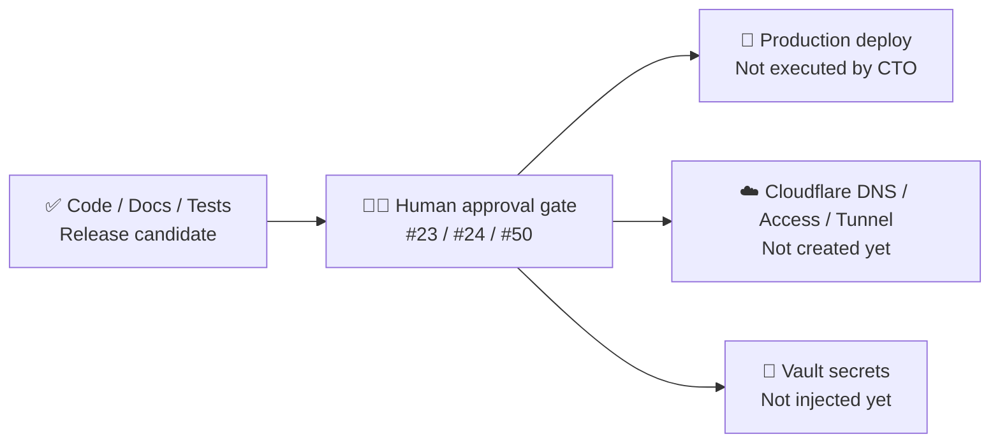
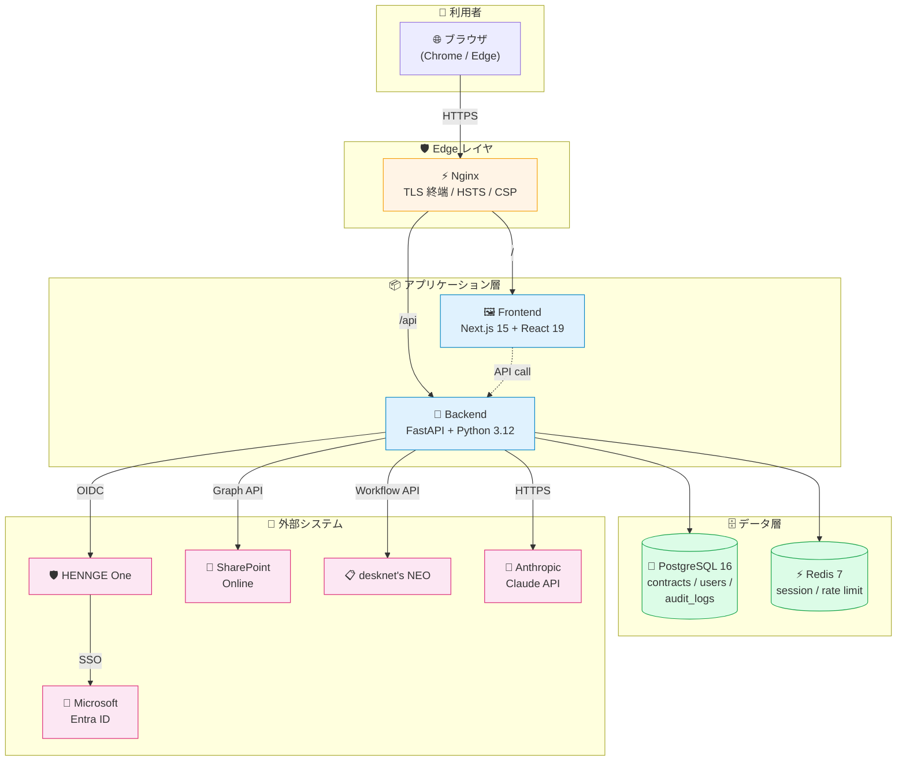
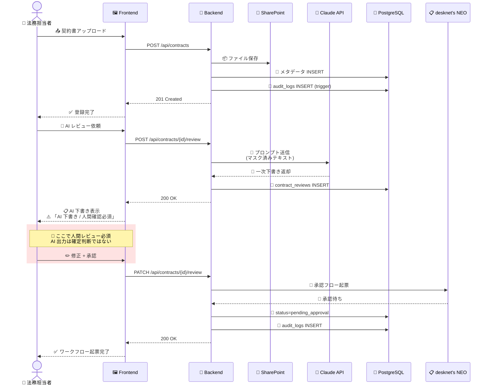
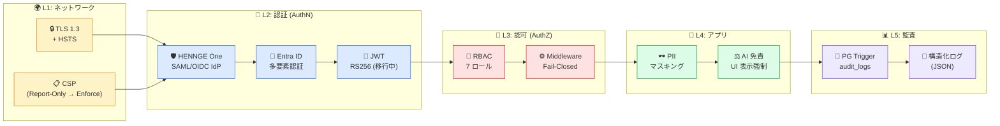
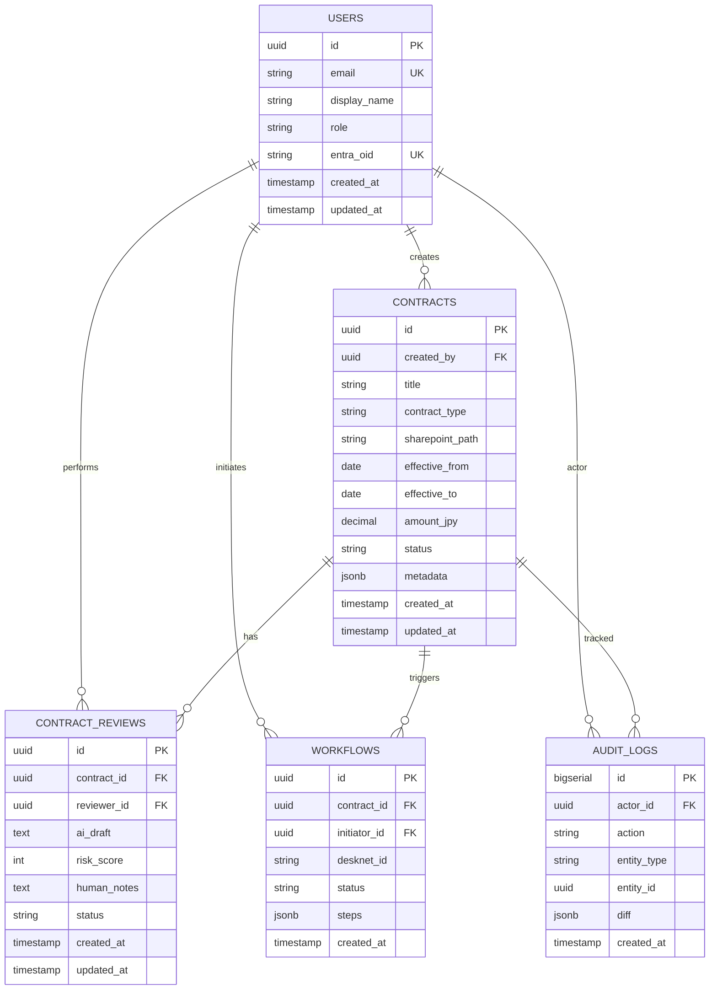
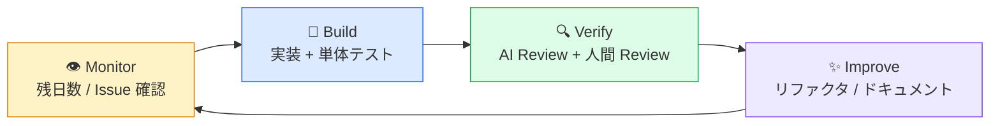

# 🏗️ Construction-LegalOps-DX

[](./.github/workflows/ci.yml)
[](./LICENSE)
[](./.github/workflows/ci.yml)
[](https://www.python.org/)
[](https://nodejs.org/)
[](https://nextjs.org/)
[](https://fastapi.tiangolo.com/)
[](https://www.postgresql.org/)
[](https://www.conventionalcommits.org/)

> 🏢 **建設業 600 名規模** の法務・契約・コンプライアンス業務を、AI 支援と既存 SaaS 連携で DX するための **社内基盤プロジェクト** です。
> ⚖️ **AI は法的判断を確定しません。** 最終判断は必ず法務担当者・顧問弁護士が行います。

---

## 🚦 現在のリリース直前状態 (2026-07-19 / Loop 91)

| 項目 | 現在状態 | 補足 |
|---|---|---|
| ✅ コード完成度 | Release candidate | Phase 1 のフロントエンド / バックエンド / DB / 監査 / 監視 / 運用文書は実装・検証済み |
| 🛑 本番リリース / deploy | 未実行 | CTO/Supervisor は **本番直前の承認待ち** で停止 |
| 🌐 公開 DNS | 未変更 | `legalops.mirai-dx-platform.com` CNAME / A は未作成 |
| ☁️ Cloudflare | 承認待ち | `legalops` 新規サブドメイン要件を反映済み。Access / Tunnel / DNS CNAME / cloudflared token は #50 の人間作業 |
| 🔐 Secrets | 未投入 | Vault / Key Vault 本番 secret 投入は #23 の人間作業 |
| 🛡️ CSP | Report-Only | enforce 切替は #24 の人間承認後 |
| 🖥️ 検証用 WebUI | 起動・検証済み | `http://192.168.0.185:38100/` / `construction-legalops-standalone-webui.service` / runtime preflightでHTML実体・status JSON・自動port範囲・listen実体を検証 |
| 📊 GitHub / CI | 同期・検証済み | Project #30 / #23 / #24 / #50 / open PR 0 / 最新CI成功を GitHub release gate preflightで検証 |
| ⚠️ Pre-deploy warnings | 既知・分類済み | 本番secret / SSO / AI key / Docker build skip の5件のみ。未知warning 0 |
| 📋 Release checklist | 分類済み | 未チェック73件は人間承認 / 本番実行 / リリース後確認項目として分類済み |
| 🛑 Stop-line証跡 | 検証済み | Git tag 0 / GitHub Release 0 / GitHub Deployments 0 / legalops DNS未作成 |
| 🎯 Goal evidence | 検証済み | `/goal` 完了条件と証拠表・最終報告・停止線の対応を `verify_goal_completion_evidence.sh` で検証 |
| 🔍 Review evidence | 検証済み | CodeRabbit timeout / 代替静的検証 / security review / Critical-High limitation を `verify_review_evidence.sh` で検証 |
| 🧬 Dependency audit | 検証済み | npm high/critical 0、moderate 4 は既知残リスク、pip-audit 72 deps / 0 vulnerabilities |
| 📎 SharePoint Graph | 実装・検証済み | SharePoint Graph real mode は Entra client-credentials + Microsoft Graph drive upload / webUrl 解決に対応。unit contract 33 passed |
| 📣 Notification real mode | 実装・検証済み | Exchange Graph sendMail / Teams webhook / desknet's webhook を mock contract で検証。unit 32 passed |
| 📤 Contract submit | 実装・検証済み | `POST /contracts/{id}/submit` は draft → in_review に遷移。unit/integration contract 38 passed、ruff/mypy clean |
| 📑 Contract subresources | 実装・検証済み | `/contracts/{id}/versions` と `/contracts/{id}/clauses` は DB-backed / current snapshot で 501 stub 回避。unit/integration contract 43 passed |
| 📋 最終判断資料 | 整備済み | [`docs/PRODUCTION_APPROVAL_PACKET.md`](./docs/PRODUCTION_APPROVAL_PACKET.md) / [`docs/FINAL_RELEASE_STOP_REPORT.md`](./docs/FINAL_RELEASE_STOP_REPORT.md) |



---

## 📚 目次

### 📖 第 1 部 — 概要篇（ビジネス・運用視点）

1. 🎯 [このプロジェクトについて](#-このプロジェクトについて)
2. 👥 [想定ユーザーと利用シーン](#-想定ユーザーと利用シーン)
3. ✨ [主な機能](#-主な機能)
4. 💎 [もたらすビジネス価値](#-もたらすビジネス価値)
5. ⚖️ [AI 法務免責 — 絶対遵守ポリシー](#️-ai-法務免責--絶対遵守ポリシー)
6. 📅 [プロジェクトタイムライン](#-プロジェクトタイムライン)

### 🛠️ 第 2 部 — 技術要件篇（エンジニア視点）

7. 🏛️ [システムアーキテクチャ](#️-システムアーキテクチャ)
8. 🔄 [契約レビュー処理フロー](#-契約レビュー処理フロー)
9. 🛡️ [セキュリティモデル](#️-セキュリティモデル)
10. 🗃️ [データモデル](#️-データモデル)
11. 🧱 [技術スタック詳細](#-技術スタック詳細)
12. 📁 [ディレクトリ構造](#-ディレクトリ構造)
13. 🚀 [Quick Start](#-quick-start)
14. 🧪 [開発フロー](#-開発フロー)
15. 🤝 [コントリビューション](#-コントリビューション)
16. 📜 [ライセンス](#-ライセンス)

---

# 📖 第 1 部 — 概要篇

## 🎯 このプロジェクトについて

**Construction-LegalOps-DX** は、建設業界に特化した法務オペレーション支援プラットフォームです。

🏗️ 建設業の現場・本社・法務部門にまたがる契約レビュー、下請法対応、建設業法に基づく書類整備、社内法令照会といった業務を、**AI アシスト + 既存業務システム連携** によって統合的に効率化します。

🌟 **三本柱** で業務を支えます：

- 📑 **契約・法務ドキュメント管理** — SharePoint と連携した契約台帳・期限通知・電子帳簿保存法対応のメタデータ管理
- 🤖 **AI 法務アシスト** — Claude API による契約書要約・リスク観点抽出・社内ナレッジ Q&A（**必ず人間レビューを経由**）
- 🔗 **業務システム連携** — desknet's NEO ワークフロー、Microsoft Entra ID SSO、HENNGE One によるアクセス制御

---

## 👥 想定ユーザーと利用シーン

| 👤 ロール             | 🎯 主な利用シーン                                              |
| --------------------- | -------------------------------------------------------------- |
| 👷 **現場担当者**     | 下請契約のひな形検索、契約期限の自動通知の受信                 |
| 📋 **法務担当者**     | 契約書一次レビューの AI 下書き確認、リスク分類、修正候補の検討 |
| 🏢 **管理部門**       | 監査ログ閲覧、ワークフロー承認、コンプライアンス報告書出力     |
| ⚖️ **顧問弁護士**     | エスカレーション案件の最終確認、法的判断の確定                 |
| 🛡️ **情報システム部** | RBAC / 監査ログ / Entra ID 連携の運用管理                      |

🏭 **想定組織規模**: 従業員 約 600 名、公共工事 80% / 民間工事 20% の建設・土木企業

---

## ✨ 主な機能

### 📝 契約書ライフサイクル管理

- 📤 アップロード（ドラッグ&ドロップ対応、SharePoint 自動同期）
- 🔖 メタデータ管理（契約種別・契約金額・契約期間・対応条文）
- ⏰ 期限通知（90日 / 30日 / 7日前に自動アラート）
- 🗂️ バージョン管理（改訂履歴 + diff 表示）

### 🤖 AI 法務アシスト

- 📊 契約書のリスク観点抽出（5段階スコアリング）
- ✍️ 修正候補の **下書き** 提示（最終判断は人間）
- 🔍 社内規程・建設業法・下請法に基づく一次回答
- 🧠 Claude API（Anthropic）による高精度な日本語処理

### 🔄 ワークフロー連携

- ✅ desknet's NEO による承認フロー
- 📨 Entra ID メールによる通知
- 📌 GitHub Projects 風の進捗ボード

### 📊 監査・コンプライアンス

- 📜 全操作の監査ログ自動記録（PostgreSQL トリガー）
- 🔐 RBAC による 7 ロールアクセス制御
- 📅 電子帳簿保存法に基づく保存期間管理

---

## 💎 もたらすビジネス価値

| 指標                    | 🎯 期待効果                                          |
| ----------------------- | ---------------------------------------------------- |
| ⏱️ **契約レビュー時間** | 平均 60 分 → 20 分（66% 削減）                       |
| 📉 **見落としリスク**   | AI 一次レビューによる二重チェック体制                |
| 🔍 **検索効率**         | 紙台帳・Excel 管理 → 数秒で全文検索                  |
| 📋 **監査対応工数**     | 法定書類提出を半自動化                               |
| 🛡️ **コンプライアンス** | 建設業法・下請法・電子帳簿保存法の準拠を自動的に支援 |

💰 **投資回収**: 法務 + 管理部門 5 名 × 月 20 時間削減 ≈ 年間 1,200 時間の生産性向上

---

## ⚖️ AI 法務免責 — 絶対遵守ポリシー

> 🚨 **このセクションは契約締結 / 法的助言 / 業務利用におけるすべての関係者が必ず読むべき内容です。**

### 🤖 AI の役割

✅ AI（Claude API）は以下を **支援** します：

- 📄 契約書の一次レビュー
- 🎯 論点抽出
- ⚠️ リスク分類
- ✏️ 修正候補の提示
- 📚 証跡整理

### 👨‍⚖️ 最終判断の所在

⚖️ **最終判断は以下が行います：**

- 📋 法務担当者
- 🏢 管理部門
- ⚖️ 必要に応じて **顧問弁護士**

### 🚫 禁止行為（5 項目）

| #   | 🚫 禁止内容                                      |
| --- | ------------------------------------------------ |
| 1   | AI が法的結論を **断定** すること                |
| 2   | 弁護士確認が必要な事項を **自動承認** すること   |
| 3   | 機密契約書を **無制御** に外部 AI へ送信すること |
| 4   | **監査ログなし** でレビュー結果を変更すること    |
| 5   | 承認済み契約を **無断変更可能** な設計にすること |

### 📖 関連ドキュメント

- 📄 [`docs/ai_disclaimer_policy.md`](./docs/ai_disclaimer_policy.md) — AI 免責ポリシー詳細
- ⚖️ [`docs/legal_playbook.md`](./docs/legal_playbook.md) — 法務オペレーションプレイブック
- 🔒 [`docs/security_policy.md`](./docs/security_policy.md) — セキュリティポリシー

---

## 📅 プロジェクトタイムライン

🗓️ 本プロジェクトは **登録日から 6 ヶ月の固定スコープ** で運営されます。**リリース期限は絶対厳守** です。

| 項目                  | 📆 日付            |
| --------------------- | ------------------ |
| 🚀 プロジェクト登録日 | **2026-05-16**     |
| 🎯 本番リリース期限   | **2026-11-16**     |
| ⏳ 期間               | 6 ヶ月 (約 184 日) |

### 🗺️ 6 ヶ月ロードマップ

| 期間                                     | 🎯 フォーカス                       | ✅ ステータス                                                  |
| ---------------------------------------- | ----------------------------------- | -------------------------------------------------------------- |
| ✅ Month 1〜2 (2026-05-16 〜 2026-07-15) | 基盤整備・主要機能実装 (Loop 1〜30) | 🏁 **完了** (v0.1.11 / 30 ループ / 832+ tests / 91% coverage) |
| 🔧 Month 3〜4 (2026-07-16 〜 2026-09-15) | 品質向上・テスト整備 (Loop 31〜56) | 🏁 **Phase 1 完了** (v0.1.12 / 900+ tests / CF/Neon IaC / 監視・Incident運用 / fail-closed test gates / release docs sync) |
| 🧪 Month 5 (2026-09-16 〜 2026-10-15)    | 統合テスト・バグ修正                | ⏳ 未着手                                                      |
| 🎉 Month 6 (2026-10-16 〜 2026-11-16)    | リリース準備・本番移行              | ⏳ 未着手（人間は Vault secrets 投入 + CSP enforce 切替 + CF/Neon リソース作成） |

### ⚠️ 残日数による自動縮退ルール

リリース期限 **2026-11-16** までの残日数に応じ、開発スコープを自動縮退します。

- 🟡 **残 30 日以内**: Improvement 縮退、Verify / リリース準備を最優先
- 🟠 **残 14 日以内**: 新機能開発禁止、バグ修正・安定化のみ
- 🔴 **残 7 日以内**: リリース準備のみ（CHANGELOG / README / タグ付け / RELEASE_CHECKLIST 完遂）

📖 詳細: [`docs/HANDOVER.md`](./docs/HANDOVER.md) / [`docs/RELEASE_CHECKLIST.md`](./docs/RELEASE_CHECKLIST.md)

---

---

# 🛠️ 第 2 部 — 技術要件篇

## 🏛️ システムアーキテクチャ

🌐 全体構成は **3 層 + 外部連携** の構造です。Nginx で TLS 終端と HSTS/CSP を適用し、Frontend (Next.js) と Backend (FastAPI) を分離。永続化層は PostgreSQL 16 + Redis 7 で構成しています。



---

## 🔄 契約レビュー処理フロー

📝 契約書のアップロードから AI 一次レビュー、人間の最終承認までのシーケンスを示します。**🔴 赤い網掛けは AI 出力 → 人間レビュー必須の境界線** です。



---

## 🛡️ セキュリティモデル

🔐 多層防御（Defense in Depth）を採用し、**Fail-Closed** を基本方針としています。認証・認可・PII マスキングが異常時は **常に拒否側** へ倒します。



### 🛂 RBAC ロール一覧

| 🎭 ロール         | 📝 権限範囲                                         |
| ----------------- | --------------------------------------------------- |
| 👑 `admin`        | 全権限（運用管理者のみ）                            |
| ⚖️ `legal_lead`   | 契約書 R/W、AI レビュー実行、ワークフロー起票・承認 |
| 📋 `legal_member` | 契約書 R/W、AI レビュー実行（承認権限なし）         |
| 🏢 `manager`      | 部門配下の契約書 R/W、承認                          |
| 👷 `site_member`  | 自己起票の契約書のみ R/W                            |
| 🔍 `auditor`      | 全契約書・監査ログの R のみ                         |
| 👁️ `viewer`       | 公開済み契約書の R のみ                             |

---

## 🗃️ データモデル

🐘 PostgreSQL 16 における主要テーブルの ER 図です。全テーブルに `created_at` / `updated_at` を持ち、`audit_logs` は INSERT/UPDATE/DELETE トリガーで自動記録されます。



---

## 🧱 技術スタック詳細

### 🚀 バックエンド

| カテゴリ            | 技術                    | バージョン        |
| ------------------- | ----------------------- | ----------------- |
| 🐍 言語             | Python                  | 3.12              |
| ⚡ フレームワーク   | FastAPI                 | 0.115.x           |
| 🗃️ ORM              | SQLAlchemy              | 2.x               |
| 🔧 マイグレーション | Alembic                 | latest            |
| 🔑 認証             | Entra ID (OIDC) + JWT   | RS256 (移行中)    |
| 🤖 AI               | Anthropic Claude API    | `claude-opus-4-7` |
| 🧪 テスト           | pytest / pytest-asyncio | 8.x               |
| 🛠️ 品質             | ruff / mypy / bandit    | latest            |

### 🖼️ フロントエンド

| カテゴリ          | 技術                             | バージョン  |
| ----------------- | -------------------------------- | ----------- |
| ⚛️ フレームワーク | Next.js (App Router)             | 15.0.3      |
| 📘 言語           | TypeScript                       | 5.6.x       |
| 🎨 UI             | React + Tailwind CSS + shadcn/ui | React 19 RC |
| 🔄 状態管理       | TanStack Query                   | 5.x         |
| 📝 フォーム       | react-hook-form + zod            | latest      |
| 🧪 テスト         | Jest / React Testing Library     | 29.x / 16.x |
| 🛠️ 品質           | ESLint / Prettier / tsc          | 9.x / 3.x   |

### 🏗️ インフラ

| カテゴリ                | 技術                       |
| ----------------------- | -------------------------- |
| 🐘 DB                   | PostgreSQL 16              |
| ⚡ キャッシュ           | Redis 7                    |
| 🔀 リバースプロキシ     | Nginx (TLS / HSTS / CSP)   |
| 🐳 コンテナ             | Docker / docker compose v2 |
| 🔄 CI/CD                | GitHub Actions             |
| 🔒 セキュリティスキャン | Trivy / Bandit / npm audit |

### 🔗 外部システム連携

| カテゴリ              | サービス             | 用途                       |
| --------------------- | -------------------- | -------------------------- |
| 🛡️ アクセス制御       | HENNGE One           | IdP プロキシ・端末認証     |
| 🔑 SSO                | Microsoft Entra ID   | OIDC 認証・RBAC ソース     |
| 📧 メール             | Microsoft 365        | 通知配信                   |
| 📂 ストレージ         | SharePoint Online    | 契約書ファイル保管         |
| ☁️ クラウドストレージ | DirectCloud          | 大容量ファイルバックアップ |
| 📋 ワークフロー       | desknet's NEO        | 承認フロー                 |
| 🤖 AI                 | Anthropic Claude API | 法務 AI アシスト           |

---

## 📁 ディレクトリ構造

```
📦 Construction-LegalOps-DX/
├── 🚀 backend/                  # FastAPI アプリケーション
│   ├── app/
│   │   ├── api/                # ルーター層 (v1 endpoints)
│   │   ├── core/               # 設定・認証・セキュリティ
│   │   ├── models/             # SQLAlchemy モデル
│   │   ├── schemas/            # Pydantic スキーマ
│   │   ├── services/           # ドメインサービス (13 modules)
│   │   └── middleware/         # RBAC / 監査ログ / レート制限
│   ├── tests/                  # pytest (77+ tests)
│   └── alembic/                # マイグレーション
├── 🖼️ frontend/                 # Next.js アプリケーション
│   ├── src/
│   │   ├── app/                # App Router pages
│   │   ├── components/         # UI コンポーネント (shadcn/ui)
│   │   ├── hooks/              # TanStack Query hooks
│   │   └── lib/                # API クライアント / 型定義
│   └── public/                 # 静的アセット
├── 🏗️ infra/                    # インフラ関連
│   ├── docker/                 # docker-compose 一式
│   ├── nginx/                  # nginx 設定 (TLS/HSTS/CSP)
│   └── scripts/                # 補助スクリプト
├── 📚 docs/                     # 仕様書・ADR・ポリシー
│   ├── HANDOVER.md             # 次セッション引き継ぎ
│   ├── RELEASE_CHECKLIST.md    # 本番リリース前チェック
│   ├── security_policy.md      # セキュリティポリシー
│   ├── ai_disclaimer_policy.md # AI 免責ポリシー
│   └── legal_playbook.md       # 法務プレイブック
├── ⚙️ .github/workflows/        # GitHub Actions CI
├── 📝 .env.example              # 環境変数サンプル
├── 📜 LICENSE                   # MIT License
├── 📰 CHANGELOG.md
├── 🤝 CONTRIBUTING.md
└── 📖 README.md
```

---

## 🚀 Quick Start

### 📋 必要環境

- 🐳 **Docker** 24.x 以上 + docker compose v2
- 🐍 **Python** 3.12（ローカル backend 開発時）
- 🟢 **Node.js** 20.x（ローカル frontend 開発時）
- 💻 **OS**: Linux / macOS / WSL2

### 1️⃣ リポジトリ取得と環境変数

```bash
git clone https://github.com/Kensan196948G/Construction-LegalOps-DX.git
cd Construction-LegalOps-DX
cp .env.example .env
```

📝 `.env` の主要キー（本番は Vault / Key Vault 経由を推奨）：

| 🔑 キー                                                       | 📝 用途                 | 📍 取得元              |
| ------------------------------------------------------------- | ----------------------- | ---------------------- |
| `POSTGRES_PASSWORD`                                           | DB パスワード           | `openssl rand -hex 32` |
| `JWT_SECRET`                                                  | JWT 署名鍵 (HS256 開発用。 本番は RS256 鍵を Vault 管理) | `openssl rand -hex 32` |
| `ENTRA_TENANT_ID` / `ENTRA_CLIENT_ID` / `ENTRA_CLIENT_SECRET` | Entra ID SSO            | Azure Portal           |
| `HENNGE_*`                                                    | HENNGE One IdP プロキシ | HENNGE 管理画面        |
| `CLAUDE_API_KEY`                                              | Claude API              | Anthropic Console      |
| `SHAREPOINT_SITE_URL` / `SHAREPOINT_DRIVE_ID`                 | SharePoint 連携         | M365 管理センター      |

### 2️⃣ Docker Compose で一括起動

```bash
docker compose -f infra/docker/docker-compose.yml up -d
docker compose -f infra/docker/docker-compose.yml exec backend alembic upgrade head
```

### 3️⃣ アクセス先

> 🔢 **専用ポート割当**（マルチプロジェクト共存ホストでの衝突回避）。詳細は [`docs/PORT_ALLOCATION.md`](docs/PORT_ALLOCATION.md) を参照。

| 🌐 URL                          | 📝 用途                     |
| ------------------------------- | --------------------------- |
| `http://localhost:8410`         | 🖼️ Frontend (nginx 経由)    |
| `http://localhost:8410/api/`    | 🚀 Backend API (nginx 経由) |
| `http://localhost:3010`         | 🖼️ Frontend (直接)          |
| `http://localhost:8010`         | 🚀 Backend (直接)           |
| `http://localhost:8410/healthz` | 💓 ヘルスチェック           |

### 🖥️ Standalone WebUI（SSH先Linux / systemd運用）

SSH 先の Linux ルートフォルダでは、生成済みの [`docs/Construction-LegalOps-DX (Standalone).html`](docs/Construction-LegalOps-DX%20(Standalone).html) を**変換せずそのまま配信**する Standalone WebUI を systemd で常駐できます。
IP アドレスとポートは起動時に自動選択され、URL / PID / 停止情報は [`reports/webui/standalone-webui.json`](reports/webui/standalone-webui.json) に保存されます。
ポートは `38100-38999` から空き番号を自動選択します。
systemd 起動時の `stop_command` は `systemctl --user stop construction-legalops-standalone-webui.service` になります。

現在の検証用 WebUI は SSH 先 Linux 上で systemd user service として稼働中です。

| 🧭 項目 | ✅ 現在値 |
|---|---|
| URL | `http://192.168.0.185:38100/` |
| Health | `http://192.168.0.185:38100/healthz` → `ok` |
| HEAD | `curl -fsSI http://192.168.0.185:38100/` → `200 OK` / `text/html; charset=utf-8` |
| Source endpoint | `http://192.168.0.185:38100/standalone-source` |
| systemd unit | `construction-legalops-standalone-webui.service` (`enabled` / `active`) |
| Status file | `reports/webui/standalone-webui.json` (`host=192.168.0.185`, `port=38100`) |
| Listen | `192.168.0.185:38100` / PID は status JSON と一致 |
| 停止 | `ssh kensan@192.168.0.185 "systemctl --user stop construction-legalops-standalone-webui.service"` |

| 🧭 操作 | 🔧 コマンド |
| ------- | ----------- |
| systemd 登録 + 起動 | `bash scripts/install_standalone_webui_systemd.sh --user install` |
| SSHログアウト後も維持 | `bash scripts/install_standalone_webui_systemd.sh --user --linger install` |
| systemd 状態 | `bash scripts/install_standalone_webui_systemd.sh --user status` |
| HTTP health | `bash scripts/install_standalone_webui_systemd.sh --user health` |
| 再起動 | `bash scripts/install_standalone_webui_systemd.sh --user restart` |
| 停止 | `bash scripts/install_standalone_webui_systemd.sh --user stop` |
| 登録解除 | `bash scripts/install_standalone_webui_systemd.sh --user uninstall` |

systemd unit 名は `construction-legalops-standalone-webui.service` です。
root 管理の system unit として登録する場合のみ `--system` を使います。

🧪 Standalone WebUI の配信契約は、ルート直下から次のテストで確認できます。
`/` と `/index.html` が HTML ファイルをバイト単位でそのまま返し、`/healthz`、`/standalone-source`、systemd 用 `stop_command`、status JSON、`38100-38999` の自動ポート選択、実 listen が壊れていないことを検証します。

```bash
python -m pytest tests/test_standalone_webui.py -q
python -m py_compile scripts/serve_standalone_webui.py
bash -n scripts/install_standalone_webui_systemd.sh
```

Windows 端末から SSH 越しに Linux 側の root folder を操作する場合は、`HostName` と Linux 上の `RemoteRepo` を指定します。

```powershell
# 実行前確認（SSH先では何も変更しない）
pwsh -NoProfile -ExecutionPolicy Bypass -File scripts/Invoke-StandaloneWebUILinux.ps1 `
  -HostName "<linux-host>" `
  -RemoteRepo "/path/to/Construction-LegalOps-DX" `
  -Action install `
  -Mode user `
  -Linger `
  -DryRun

# Linux上で生成されるsystemd unitを確認
pwsh -NoProfile -ExecutionPolicy Bypass -File scripts/Invoke-StandaloneWebUILinux.ps1 `
  -HostName "<linux-host>" `
  -RemoteRepo "/path/to/Construction-LegalOps-DX" `
  -Action install `
  -Mode user `
  -PrintUnit

# systemd登録 + 起動 + health確認
pwsh -NoProfile -ExecutionPolicy Bypass -File scripts/Invoke-StandaloneWebUILinux.ps1 `
  -HostName "<linux-host>" `
  -RemoteRepo "/path/to/Construction-LegalOps-DX" `
  -Action install `
  -Mode user `
  -Linger

# 状態確認 + reports/webui/standalone-webui.json 回収
pwsh -NoProfile -ExecutionPolicy Bypass -File scripts/Invoke-StandaloneWebUILinux.ps1 `
  -HostName "<linux-host>" `
  -RemoteRepo "/path/to/Construction-LegalOps-DX" `
  -Action status `
  -Mode user

# HTTP healthのみ確認
pwsh -NoProfile -ExecutionPolicy Bypass -File scripts/Invoke-StandaloneWebUILinux.ps1 `
  -HostName "<linux-host>" `
  -RemoteRepo "/path/to/Construction-LegalOps-DX" `
  -Action health `
  -Mode user
```

#### 🪟 Codex デスクトップ / Windows 側からの一時プレビュー

| 🧭 操作 | 🔧 コマンド |
| ------- | ----------- |
| 起動 / 再利用 | `pwsh -NoProfile -ExecutionPolicy Bypass -File scripts/Start-StandaloneWebUI.ps1` |
| 状態確認 | `pwsh -NoProfile -ExecutionPolicy Bypass -File scripts/Get-StandaloneWebUIStatus.ps1` |
| 停止 | `pwsh -NoProfile -ExecutionPolicy Bypass -File scripts/Stop-StandaloneWebUI.ps1` |

### 4️⃣ 開発モード（ホットリロード）

```bash
# 🚀 backend
cd backend && python -m venv .venv && source .venv/bin/activate
pip install -r requirements.txt
uvicorn app.main:app --reload --port 8010

# 🖼️ frontend
cd frontend && npm install && npm run dev
```

### 🛑 停止

```bash
docker compose -f infra/docker/docker-compose.yml down
```

---

## 🧪 開発フロー

🔁 本プロジェクトは **6 ヶ月固定スコープ** で `Monitor → Build → Verify → Improve` のループサイクルで運用されます。



### 📋 PR 作成手順

1. 📝 **Issue 起票** — GitHub Projects に紐付け（Goal / Loop / Phase ラベル必須）
2. 🌿 **ブランチ作成** — `feature/<topic>` / `fix/<topic>` / `docs/<topic>`
3. ✅ **実装** — Conventional Commits 準拠
4. 📤 **PR 作成** — `main` 向け、Test Plan を記載
5. 🤖 **AI レビュー** — `/codex:review` + `/coderabbit:review` 併用、Critical/High はマージ前必須解消
6. 👥 **人間レビュー** — 認証・認可・DB スキーマ・並列処理変更時は **対抗レビュー必須**
7. 🔀 **マージ** — Squash Merge 推奨、CHANGELOG.md に追記

### ✅ ローカル品質チェック

```bash
# 🚀 backend
cd backend && ruff check . && mypy app && pytest

# 🖼️ frontend
cd frontend && npm run lint && npm run typecheck && npm test
```

---

## 🤝 コントリビューション

📖 開発参加方法・コミット規約・PR テンプレートは [`CONTRIBUTING.md`](./CONTRIBUTING.md) を参照してください。

🎯 主な要点：

- 📝 **Conventional Commits** 採用（`feat:`, `fix:`, `docs:`, `refactor:`, `test:`, `chore:` など）
- 👥 PR は最低 **1 名の人間レビュアー + AI レビュー** 両方の承認を経てマージ
- 🛡️ セキュリティ指摘（Trivy / Bandit）は **Critical / High** を必ず解消
- 🎨 UI / プロンプト / 法務文言を変更する場合は **法務担当者の事前確認** が必要

---

## 📜 ライセンス

📄 本プロジェクトは [MIT License](./LICENSE) のもとで公開されています。

```
Copyright (c) 2026 Construction-LegalOps-DX Contributors
```

---

> 📌 本 README は **Phase 1 最終整備（Loop 88, 2026-07-19 更新）** 時点のものです。
>
> | 指標                  | 値                                                                                   |
> | --------------------- | ------------------------------------------------------------------------------------ |
> | 📦 バージョン         | v0.1.12                                                                              |
> | 🧪 バックエンドテスト | 900+ passed / 0 failed（pre-deploy gate）                                            |
> | 📊 カバレッジ         | 89%                                                                                  |
> | 🔧 mypy               | 0 errors (97 files) / ruff clean                                                     |
> | 🔒 Security scan      | Bandit clean (High 0 / Critical 0)                                                   |
> | 🧩 API 完成度         | AI review / templates / users / auth callback / uploads / notifications DB-backed 化 |
> | 🗄️ 全サービス         | risk/compliance/knowledge/template/clause-library/reviews/workflows (全 DB バック化) |
> | 👥 ユーザー管理       | list/detail/create/update/identity-link/soft-delete/sync受付 DB-backed + audit       |
> | 📎 アップロード       | signed upload token + attachments metadata DB-backed + soft delete                  |
> | 📎 SharePoint Graph   | SharePoint Graph real mode 実装済み（client-credentials / drive upload / webUrl 解決 / fail-closed tests 33 passed） |
> | 📣 Notification real  | Notification real mode 実装済み（Exchange Graph sendMail / Teams webhook / desknet's webhook / fail-closed tests 32 passed） |
> | 📤 Contract submit    | `POST /contracts/{id}/submit` は legacy 501 stub を撤去し draft → in_review 遷移を実装（unit/integration 38 passed / ruff / mypy） |
> | 📑 Contract subresources | `/contracts/{id}/versions` current snapshot と `/contracts/{id}/clauses` DB-backed seq order を実装（unit/integration 43 passed / ruff / mypy） |
> | 🔐 SSO callback/logout | SSOService wrapper + HttpOnly cookie / idempotent logout                            |
> | ⚡ E2E                | Playwright 51 passed（Docker公式イメージ・knowledge詳細含む・CI HARD gate）          |
> | 🧪 Jest               | 35 passed / CI HARD gate                                                             |
> | 📈 負荷テスト         | k6 smoke/load/soak（`infra/k6/`・SLO p95<500ms・週次 + 手動 CI）                     |
> | 🏥 /readyz            | Deep check (DB critical + Redis/Claude degraded)                                     |
> | 🔐 RS256              | 鍵ローテーション対応（kid ヘッダ + JWT_PUBLIC_KEYS 退役鍵検証）main マージ済み       |
> | ☁️ Cloudflare/Neon     | IaC コード完成（`legalops.mirai-dx-platform.com` 新規サブドメイン DNS案 / Access / Tunnel / Tunnel compose overlay / Neon config / read-only preflight / Runbook公式根拠）— 本番適用は人間待ち |
> | 📊 監視基盤           | Prometheus + Alertmanager + Grafana + Loki/Promtail + 追加メトリクス                 |
> | 📢 Incident運用       | On-call役割表 + GitHub incident labels + unhealthy watchdog 整備済み                |
> | 🗄️ Migration rollback | 一時 PostgreSQL 16 で Alembic roundtrip 検証済み（upgrade/downgrade/idempotent）      |
> | 🔍 Pre-deploy gate    | ruff/mypy/pytest/migration/typecheck/eslint/Bandit/npm audit/dependency audit evidence/secret scan/compose/Standalone WebUI runtime/Cloudflare legalops/release docs/goal evidence/review evidence/GitHub release gate/latest CI/warning classification/checklist pending classification/production stop-line |
> | 🔧 JIT プロビジョニング | 完了（audit chain 統合 + commit 窓可観測性）                                        |
>
> 🖥️ 検証用 WebUI: `http://192.168.0.185:38100/` (`/healthz` = `ok`, systemd active)
> 🎯 本番リリース **2026-11-16** 残課題: Vault secrets 投入(P0) / CSP enforce(P0) / CF/Neon 本番リソース作成(P0) — コードブロッカー 0 / 本番 deploy 未実行 / 公開 DNS 未変更
> 📖 次セッション引継ぎ: [`docs/HANDOVER.md`](./docs/HANDOVER.md) ／ リリースチェックリスト: [`docs/RELEASE_CHECKLIST.md`](./docs/RELEASE_CHECKLIST.md) ／ 承認パケット: [`docs/PRODUCTION_APPROVAL_PACKET.md`](./docs/PRODUCTION_APPROVAL_PACKET.md) ／ 証拠表: [`docs/RELEASE_EVIDENCE_MATRIX.md`](./docs/RELEASE_EVIDENCE_MATRIX.md) ／ 最終停止報告: [`docs/FINAL_RELEASE_STOP_REPORT.md`](./docs/FINAL_RELEASE_STOP_REPORT.md)

---

## 🔌 Backend API カバレッジ（v0.1.12 / Loop 91）

| エンドポイント            | ステータス     | テスト数        |
| ------------------------- | -------------- | --------------- |
| `/api/v1/contracts`       | ✅ 実装+テスト | CRUD + submit + versions + clauses 回帰 |
| `/api/v1/reviews`         | ✅ 実装+テスト | 13件            |
| `/api/v1/workflows`       | ✅ 実装+テスト | 8件             |
| `/api/v1/risks`           | ✅ 実装+テスト | 5件             |
| `/api/v1/compliance`      | ✅ 実装+テスト | 6件             |
| `/api/v1/knowledge`       | ✅ 実装+テスト | 6件 (DB バック) |
| `/api/v1/templates`       | ✅ 実装+テスト | 7件 (DB バック) |
| `/api/v1/clauses-library` | ✅ 実装+テスト | 8件 (DB バック) |
| `/api/v1/audit-logs`      | ✅ 実装+テスト | 3件             |
| `/api/v1/dashboard`       | ✅ 実装+テスト | 3件             |
| `/api/v1/health`          | ✅ 実装+テスト | 3件             |
