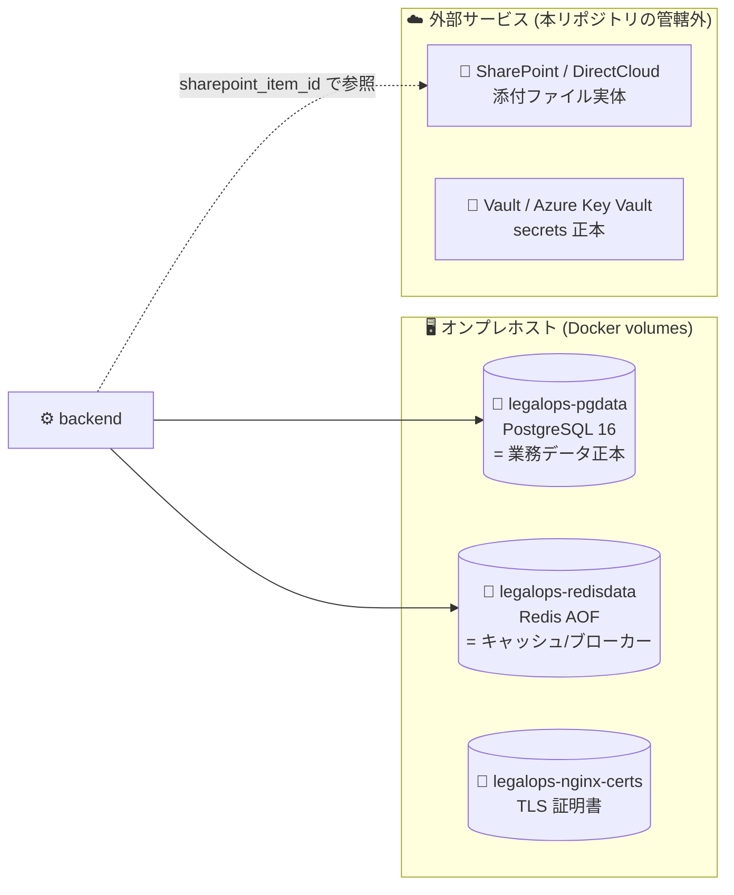

# 📌 BACKUP_RESTORE — バックアップ・リストア手順書

> Construction-LegalOps-DX のバックアップ対象の定義と、PostgreSQL 16 の pg_dump / pg_restore による
> 取得・復旧・検証手順。コマンドは compose 構成 (`infra/docker/docker-compose.yml`) のサービス名・
> 既定値 (dev: ユーザー `legalops` / DB `legalops`) に基づく。

| 項目 | 内容 |
|---|---|
| 👥 対象読者 | インフラ担当者・障害対応でリストアを実施する運用担当者 |
| 🏗️ 前提 | **本番未リリース**。Docker Compose オンプレ構成。**自動バックアップは未整備** (§6) — 現状は手動取得のみ |
| 📄 関連文書 | `docs/INCIDENT_RESPONSE.md` (リストア判断・エスカレーション) / `docs/RELEASE_CHECKLIST.md` §3 (本番 DB 要件) / `docs/database_design.md` |

> 🚨 **RPO / RTO は未定義** (本番未リリースのため業務側と未合意)。
> リリース前に業務影響に基づき RPO (許容データ損失時間) / RTO (許容復旧時間) を合意し、
> バックアップ頻度と本書の手順をそれに合わせて見直すこと (Issue 未起票 — 起票推奨)。

---

## 📌 1. データ配置の全体像



---

## 📌 2. バックアップ対象一覧表 (対象 / 対象外の判断)

| 対象 | 実体 | バックアップ | 判断根拠 |
|---|---|---|---|
| 🐘 **PostgreSQL** | volume `legalops-pgdata` | ✅ **必須 (正本)** | 契約・ユーザー・監査ログ等の業務データの単一の真実。監査ログは法定保存 (建設業法 5 年 / 電帳法 7 年 — `docs/RELEASE_CHECKLIST.md` §5) |
| 🔴 **Redis** | volume `legalops-redisdata` | ❌ **対象外** | 用途はキャッシュ + Celery broker/result backend (`docker-compose.yml` の定義)。消失しても業務データは失われず再生成可能。`appendonly yes` は再起動耐性のためでありバックアップ根拠ではない。滞留中の Celery ジョブは失われ得るが、正本 (PG) から再投入可能 |
| 🔐 **Vault / Azure Key Vault secrets** | 外部 (HashiCorp Vault or Azure Key Vault) | ✅ 必要 — **ただし Vault 製品側の機能で** | `scripts/setup_vault_secrets.sh` で投入する JWT 鍵・Entra ID・API キー等の正本は Vault 側。本プロジェクトの pg_dump ではカバーされない。Vault snapshot / Key Vault の冗長化設定を利用 (⚠️ 手順未整備 — §6) |
| 📁 **添付ファイル (契約書 PDF 等)** | **SharePoint / DirectCloud** | ❌ 本システムでは対象外 | 実装上ファイル実体は外部保管: `backend/app/models/attachment.py` に「File bytes live in SharePoint / DirectCloud; this row is the indexed metadata」と明記。DB には `sharepoint_item_id` / `checksum_sha256` 等のメタデータのみ保持 (メタデータは PG バックアップに含まれる)。実体の保全は SharePoint 側 (Microsoft 365) の保持ポリシーに依存 |
| 🔑 **TLS 証明書** | volume `legalops-nginx-certs` | 🟡 推奨 (再発行可) | Let's Encrypt なら再発行可能だが、復旧短縮のため取得しておくとよい |
| 📄 **設定・コード** | Git リポジトリ (GitHub) | ✅ Git が正本 | compose / nginx conf / alembic マイグレーションはすべてリポジトリ管理。`.env` (秘匿値) だけは Git 外 → Vault 管理 (Issue #23) |

---

## 📌 3. PostgreSQL バックアップ手順 (pg_dump)

### 3.1 ✅ 論理バックアップの取得

compose サービス名 `postgres` に対して `docker compose exec` で実行する
(dev はコンテナ名 `legalops-postgres` への `docker exec` でも可。本番 overlay でも postgres は
`container_name: legalops-postgres` のままだが、環境差を吸収できる compose 経由を推奨)。

```bash
# カスタム形式 (-Fc) — pg_restore で選択リストア・並列リストアが可能。推奨
docker compose -f infra/docker/docker-compose.yml exec -T postgres \
  pg_dump -U legalops -d legalops -Fc \
  > backup_legalops_$(date +%Y%m%d_%H%M%S).dump

# 平文 SQL が必要な場合 (psql で流し込むだけの単純リストア用)
docker compose -f infra/docker/docker-compose.yml exec -T postgres \
  pg_dump -U legalops -d legalops \
  > backup_legalops_$(date +%Y%m%d_%H%M%S).sql
```

> 💡 本番ではユーザー名・DB 名は Vault 管理の `POSTGRES_USER` / `POSTGRES_DB` の値に読み替える
> (prod overlay では既定値が無効化され `${VAR:?required in production}` で必須化されている)。
> `-T` は TTY 無効化 (リダイレクトでバイナリが壊れるのを防ぐ)。

### 3.2 📤 取得後の必須処理

```bash
# 1. 整合性確認 — 内容一覧が読めること (カスタム形式のみ)
pg_restore --list backup_legalops_<日時>.dump | head

# 2. チェックサム記録
sha256sum backup_legalops_<日時>.dump > backup_legalops_<日時>.dump.sha256

# 3. ホスト外への退避 (別サーバー / 別リージョン — docs/RELEASE_CHECKLIST.md §3 の要件)
#    ⚠️ 退避先は未確定 (本番未リリース)。リリース前に確定し、ここに追記すること。
```

| 保管ルール (推奨) | 値 |
|---|---|
| 世代数 | 日次 7 世代 + 週次 4 世代 (暫定案 — RPO 合意後に見直し) |
| 保管場所 | 稼働ホストとは**別筐体** (同一ディスク上のみの保管は不可) |
| 暗号化 | 契約データを含むため保管時暗号化必須 (`docs/security_policy.md` 準拠) |

### 3.3 🚨 マイグレーション/リストア前のバックアップ (必須)

`alembic upgrade` / `alembic downgrade` / リストアの**直前**には必ず §3.1 を実行する
(`docs/RELEASE_CHECKLIST.md` §4「バックアップ取得後にマイグレーション実行」)。

---

## 📌 4. リストア手順 (pg_restore)

> 🚨 リストアはデータを上書きする破壊的操作。実行判断は単独で行わず、
> `docs/INCIDENT_RESPONSE.md` §5 のとおり**インフラリードへエスカレーションの上**で実施する。

### 4.1 ⏪ 既存 DB への復旧 (標準手順)

```bash
# 0. アプリを停止し DB への書き込みを止める (postgres は稼働継続)
docker compose -f infra/docker/docker-compose.yml stop backend frontend nginx
docker compose -f infra/docker/docker-compose.yml --profile worker stop celery-worker celery-beat

# 1. 念のため現状もバックアップ (壊れていても取れる範囲で)
docker compose -f infra/docker/docker-compose.yml exec -T postgres \
  pg_dump -U legalops -d legalops -Fc > pre_restore_$(date +%Y%m%d_%H%M%S).dump || true

# 2. リストア実行 (--clean --if-exists: 既存オブジェクトを落としてから再作成)
docker compose -f infra/docker/docker-compose.yml exec -T postgres \
  pg_restore -U legalops -d legalops --clean --if-exists --no-owner \
  < backup_legalops_<日時>.dump

# 3. アプリ再起動
docker compose -f infra/docker/docker-compose.yml --profile worker up -d
```

### 4.2 🆕 ボリューム全損からの復旧

```bash
# 1. postgres を新規ボリュームで起動 (legalops-pgdata が失われた場合、
#    up -d で空の volume が自動作成され、POSTGRES_USER/POSTGRES_DB で初期化される)
docker compose -f infra/docker/docker-compose.yml up -d postgres

# 2. healthcheck が healthy になるのを待つ
docker compose -f infra/docker/docker-compose.yml ps postgres

# 3. §4.1 の手順 2 以降を実行
```

### 4.3 🎯 部分リストア (特定テーブルのみ)

```bash
# カスタム形式なら特定テーブルのみ復旧可能 (例: knowledge_articles)
docker compose -f infra/docker/docker-compose.yml exec -T postgres \
  pg_restore -U legalops -d legalops --no-owner -t knowledge_articles \
  < backup_legalops_<日時>.dump
```

> ⚠️ 外部キー制約 (契約 ← 添付メタデータ等) があるため、部分リストアは依存関係を理解した上で行うこと (`docs/database_design.md` 参照)。

---

## 📌 5. リストア検証手順

リストア後 (および §6.2 の定期検証時) は以下を**すべて**確認する。

```bash
# 1. マイグレーションリビジョンがバックアップ時点と一致すること
docker compose -f infra/docker/docker-compose.yml exec backend alembic current

# 2. 主要テーブルの行数がバックアップ時点の記録と整合すること
docker compose -f infra/docker/docker-compose.yml exec postgres \
  psql -U legalops -d legalops -c \
  "SELECT relname, n_live_tup FROM pg_stat_user_tables ORDER BY n_live_tup DESC LIMIT 10;"

# 3. アプリからの readiness (DB 接続が Critical チェックとして通ること)
curl -s http://localhost:8010/api/v1/readyz | jq .
#    → "status": "ready" かつ checks.db.status == "ok" であること

# 4. 監査ログテーブルの直近レコードが存在すること (法定保存対象の欠落確認)
docker compose -f infra/docker/docker-compose.yml exec postgres \
  psql -U legalops -d legalops -c \
  "SELECT max(created_at) FROM audit_logs;"

# 5. 画面からのスモーク確認 (ログイン → 契約一覧表示 → 詳細表示)
```

✅ 検証結果 (実施日・バックアップ世代・行数・確認者) は記録して保管する (監査証跡 — `docs/audit_log_policy.md`)。

---

## 📌 6. 自動バックアップ — 未整備であることの明記

> ❌ **現状、自動バックアップは存在しない** (リポジトリ内に cron 定義・バックアップスクリプトなし。
> `docs/RELEASE_CHECKLIST.md` §3 に「自動バックアップ (pg_dump + WAL アーカイブ) を日次で取得」が
> **未チェックの要件**として残っている。Issue 未起票 — 起票推奨)。
> **リリースまでに §3 の手動手順しか存在しない状態を解消すること。**

### 6.1 🔧 導入時の cron 例 (提案 — 実装は未着手)

ホスト側 (Docker ホスト) の crontab に登録する想定例:

```cron
# 毎日 02:00 JST に pg_dump を取得し 7 日より古い世代を削除 (提案値 — RPO 合意後に確定)
0 2 * * * cd /path/to/Construction-LegalOps-DX && \
  docker compose -f infra/docker/docker-compose.yml exec -T postgres \
  pg_dump -U legalops -d legalops -Fc > /backup/legalops/backup_$(date +\%Y\%m\%d).dump && \
  find /backup/legalops -name 'backup_*.dump' -mtime +7 -delete
```

導入時に併せて整備すべきもの:

- [ ] 💾 バックアップ失敗時の通知 (現状アラート機構なし — `docs/MONITORING.md` §7)
- [ ] 📤 ホスト外退避の自動化 (§3.2)
- [ ] 🔐 保管時暗号化
- [ ] 📆 WAL アーカイブ + PITR (`docs/RELEASE_CHECKLIST.md` §3 要件。pg_dump のみでは断面復旧しかできない)

### 6.2 🧪 定期リストア検証 (未実施)

- ⚠️ **リストアテストは未実施** (`docs/RELEASE_CHECKLIST.md` §3 の PITR リストアテストも未チェック)
- 本番投入前に 1 回、以後は四半期毎 (提案) にステージング相当環境で §4 → §5 を通しで実施すること

---

## 📌 7. 未整備事項サマリー (正直な現状)

| 項目 | 状態 | 追跡 |
|---|---|---|
| 💾 自動バックアップ (日次 pg_dump) | ❌ 未整備 (手動手順のみ。§6.1 は提案) | ⚠️ Issue 未起票 — 起票推奨 |
| 📆 WAL アーカイブ / PITR | ❌ 未整備 (RELEASE_CHECKLIST §3 の未チェック要件) | ⚠️ Issue 未起票 — 起票推奨 |
| 🧪 リストア検証の実績 | ❌ 未実施 (本番投入前に 1 回必須) | ⚠️ Issue 未起票 — 起票推奨 |
| 🎯 RPO / RTO | ❌ 未定義 — **リリース後ではなくリリース前に業務合意が必要** | ⚠️ Issue 未起票 — 起票推奨 |
| 📤 バックアップ退避先 (別筐体/別リージョン) | ⏳ 未確定 | ⚠️ Issue 未起票 — 起票推奨 |
| 🔐 Vault secrets のバックアップ手順 | ⏳ Vault 製品側機能に依存 — 手順未文書化 (投入自体も Issue #23 で未完) | ✅ 投入: Issue #23 / 手順: 未起票 |
| 📊 バックアップ所要時間・サイズ実測 | ⏳ **リリース後に計測して記入** | — |
