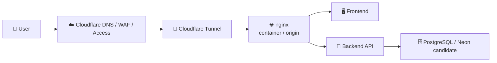

# ☁️ Cloudflare Runbook — `legalops.mirai-dx-platform.com`

> **状態: 承認待ち / 未適用 (2026-07-19 Loop 89)**  
> 本書は Cloudflare 側の実作業を安全に進めるための手順書です。`legalops` サブドメインの新規作成要件は反映済みですが、DNS 作成、Access 作成、Tunnel 作成、本番デプロイはこのセッションでは実行していません。

---

## 📌 1. 要件

| 項目 | 値 |
|---|---|
| 🌐 サブドメイン | `legalops` |
| 🏷️ FQDN | `legalops.mirai-dx-platform.com` |
| 🗂️ Zone | `mirai-dx-platform.com` |
| 🆕 要件状態 | `legalops` は新規作成対象、親ドメインは取得済み |
| 🔐 公開方針 | Cloudflare Access で認証境界を先に作る |
| 🔌 接続方式 | Cloudflare Tunnel → 既存 nginx |
| 🚫 今回実施しないこと | 公開 DNS 変更 / 本番デプロイ / 課金変更 / Secrets 投入 |

---

## 🔍 2. 現状確認

2026-07-19 時点の読み取り確認:

| 確認 | 結果 |
|---|---|
| Cloudflare Zone | `mirai-dx-platform.com` は `active` |
| Cloudflare Zone ID | `e375e651e49a40801a305b89e297bff0` |
| `mirai-dx-platform.com` NS | `kareem.ns.cloudflare.com`, `nia.ns.cloudflare.com` |
| `mirai-dx-platform.com` SOA | Cloudflare (`dns.cloudflare.com`) |
| `legalops.mirai-dx-platform.com` | Cloudflare API / DNS ともに未登録 |
| ローカル検証用 WebUI | `http://192.168.0.185:38100/` / `http://192.168.0.185:38100/healthz` |
| systemd user service | `construction-legalops-standalone-webui.service` |

確認コマンド:

```powershell
Resolve-DnsName mirai-dx-platform.com -Type NS
Resolve-DnsName mirai-dx-platform.com -Type SOA
Resolve-DnsName legalops.mirai-dx-platform.com
```

Cloudflare API で確認する場合:

```bash
# token 値は表示しないこと
./scripts/verify_cloudflare_legalops.sh
```

---

## 🏗️ 3. 推奨構成



### 判断

1. **Phase 1 は Tunnel 公開を採用**  
   Next.js / FastAPI / Celery / Redis を大きく変えず、既存 nginx を Cloudflare 前段へ接続します。承認後は
   `infra/docker/docker-compose.cloudflare-tunnel.yml` を重ね、cloudflared が Docker network 内の `nginx:80` に接続する構成を使います。

2. **Cloudflare Pages は Phase 3**  
   現状の Next.js `output: "standalone"` は Pages へそのまま載せる前提ではありません。OpenNext などへの移行後に実施します。

3. **Access を DNS 公開前に作成**  
   hostname だけ先に公開すると、認証境界より前に到達可能な瞬間が発生します。Access self-hosted application を先に準備し、DNS 切替直後から保護される状態にします。

---

## 🧾 4. DNS レコード案

Cloudflare Tunnel の DNS は CNAME で作成します。Cloudflare Docs では、Tunnel 作成時に `<TUNNEL_ID>.cfargotunnel.com` が発行され、その hostname へ CNAME を向ける構成です。Cloudflare の公式手順でも、Dashboard で CNAME を作る方法と、ローカル管理 Tunnel で `cloudflared tunnel route dns <UUID or NAME> <hostname>` を実行する方法が案内されています。

| Type | Name | Target | Proxy |
|---|---|---|---|
| `CNAME` | `legalops` | `<TUNNEL_ID>.cfargotunnel.com` | Proxied |

設定ファイル案:

- [`infra/cloudflare/dns-records.legalops.example.json`](../infra/cloudflare/dns-records.legalops.example.json)
- [`infra/cloudflare/tunnel-config.example.yml`](../infra/cloudflare/tunnel-config.example.yml)

CLI で作成する場合:

```bash
cloudflared tunnel route dns <TUNNEL_ID_OR_NAME> legalops.mirai-dx-platform.com
```

> ⚠️ このコマンドは公開 DNS を変更します。実行は人間承認後のみです。
> 現時点では `legalops` 専用 Tunnel ID が未確定のため、既存 Tunnel の流用はしません。

---

## 🔐 5. Cloudflare Access

Access application:

| 項目 | 値 |
|---|---|
| Application type | Self-hosted |
| Name | `LegalOps-DX` |
| Domain | `legalops.mirai-dx-platform.com` |
| Session duration | `24h` |
| IdP | Microsoft Entra ID |

Policy:

| Policy | Decision | Include | Require |
|---|---|---|---|
| Allow LegalOps Users | Allow | Entra ID group / approved users | MFA from IdP |
| Admin Panel | Allow | `LegalOps-Admins` | MFA from IdP |

設定案:

- [`infra/cloudflare/access-policy.yml`](../infra/cloudflare/access-policy.yml)

---

## 🚀 6. 承認後の適用順序

1. 🧑‍💼 人間: Cloudflare account / zone 権限を確認
2. 🔑 人間: 最小権限 API token を発行し GitHub Environment `production` secrets へ登録
3. 🔐 人間: Cloudflare Zero Trust で Entra ID IdP を登録
4. 🔐 人間: Access self-hosted application `LegalOps-DX` を作成
5. 🔌 人間: Tunnel を作成し `<TUNNEL_ID>` を取得
6. 🔑 人間: `CLOUDFLARE_TUNNEL_TOKEN` を Vault / secret manager へ投入
7. 🧪 CTO: `infra/cloudflare/tunnel-config.example.yml` を実値化したステージング設定で検証
8. 🔌 人間承認後: Tunnel overlay で connector を起動
9. 🌐 人間: `legalops` CNAME を `<TUNNEL_ID>.cfargotunnel.com` へ作成
10. ✅ CTO: health / Access / RBAC / audit smoke を確認

```bash
docker compose \
  -f infra/docker/docker-compose.yml \
  -f infra/docker/docker-compose.prod.yml \
  -f infra/docker/docker-compose.cloudflare-tunnel.yml \
  --profile worker \
  --profile cloudflare-tunnel up -d
```

---

## ✅ 7. 検証コマンド

```bash
# read-only preflight（DNS / Tunnel / Access は作成しない）
./scripts/verify_cloudflare_legalops.sh

dig +short NS mirai-dx-platform.com
dig +short CNAME legalops.mirai-dx-platform.com
curl -I https://legalops.mirai-dx-platform.com/healthz
cloudflared tunnel info <TUNNEL_ID_OR_NAME>
cloudflared tunnel ingress validate infra/cloudflare/tunnel-config.example.yml
```

2026-07-19 Loop 89 時点では、`./scripts/verify_cloudflare_legalops.sh` を含む pre-deploy gate が成功し、
Cloudflare API / DNS を変更しない read-only 確認で `mirai-dx-platform.com` zone が active、`legalops.mirai-dx-platform.com` の CNAME / A が未作成であること、
Tunnel ingress template が `legalops.mirai-dx-platform.com -> http://nginx:80` として検証対象になっていることを確認済みです。

Access 適用後は未認証アクセスがログインへリダイレクトされること、認証後に `/healthz` と UI が到達できることを確認します。

---

## 🛑 8. ロールバック

DNS / Tunnel 起因の障害時:

1. 🌐 Cloudflare DNS の `legalops` CNAME を削除または無効化
2. 🔌 Tunnel connector を停止
3. 🔐 Access application を disabled に変更
4. 🧪 `dig` で CNAME が消えたことを確認
5. 📋 `docs/incidents/<YYYY-MM-DD>.md` へ障害記録を残す

```bash
cloudflared tunnel cleanup <TUNNEL_ID_OR_NAME>
dig +short CNAME legalops.mirai-dx-platform.com
```

> 🚨 DNS レコードを Tunnel より先に残すと、Tunnel 停止時に利用者へ Cloudflare `1016` が出る可能性があります。

---

## 📚 9. 参照

- Cloudflare Docs: Tunnel DNS は `CNAME legalops -> <TUNNEL_ID>.cfargotunnel.com` または `cloudflared tunnel route dns <UUID or NAME> <hostname>` (`https://developers.cloudflare.com/tunnel/routing/`)
- Cloudflare Docs: Published applications は public hostname と local service の mapping (`https://developers.cloudflare.com/cloudflare-one/networks/connectors/cloudflare-tunnel/routing-to-tunnel/`)
- Cloudflare Docs: Access self-hosted application は hostname に Access application と policy を紐付けて保護 (`https://developers.cloudflare.com/cloudflare-one/access-controls/applications/http-apps/self-hosted-public-app/`)
- [`docs/CLOUDFLARE_NEON_MIGRATION_PLAN.md`](./CLOUDFLARE_NEON_MIGRATION_PLAN.md)
- [`infra/cloudflare/README.md`](../infra/cloudflare/README.md)
