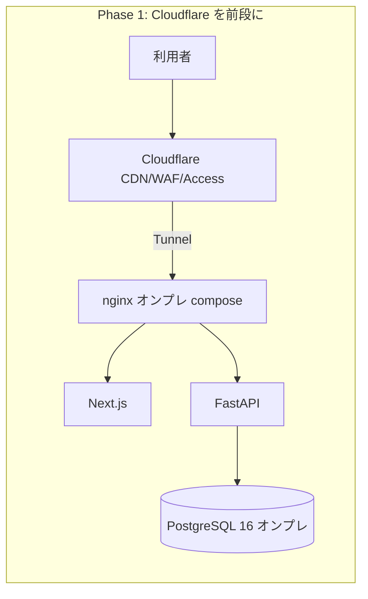
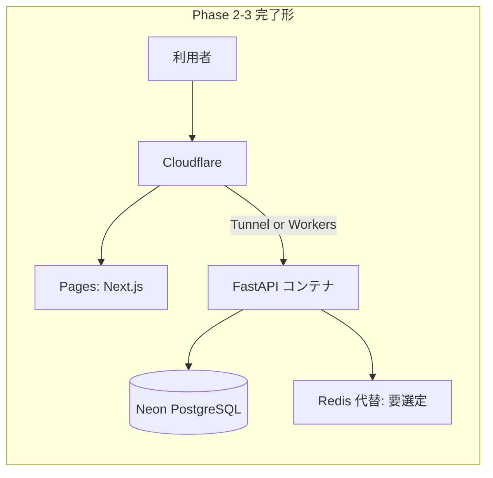

# 🌐 Cloudflare + Neon 移行計画（実装完了・本番適用待ち）

> **ステータス: ✅ IaC コード完成・本番適用は人間待ち** — DNS 変更・課金プラン変更・Secrets 投入・デプロイは一切実行していません（いずれも人間の承認・実行事項）。
>
> 作成: 2026-07-14 CTO セッション ／ 最終更新: 2026-07-19 (`legalops.mirai-dx-platform.com` Cloudflare Runbook 反映)

---

## 📌 1. 現状（事実確認の結果）

| 観点 | 事実 (2026-07-14 時点) |
|---|---|
| 🔴 本番デプロイ実績 | **無し**（git tag 0 件 / GitHub Deployments・Environments 0 件 / CD パイプライン不在） |
| 🏗️ 現行設計 | Docker Compose オンプレ（nginx + FastAPI + Celery + Next.js + PostgreSQL 16 + Redis）＋ Vault ＋ Let's Encrypt（`infra/docker/docker-compose.prod.yml`） |
| 🌐 DNS | `legalops.mirai-dx-platform.com` は **未登録 (NXDOMAIN)**。apex `mirai-dx-platform.com` はゾーン存在するも A レコード実質なし・HTTPS 不通 |
| 🔑 資格情報 | 開発環境に Cloudflare API token / wrangler / Neon 接続情報は存在しない |
| 📄 設計書上の本番 | `docs/RELEASE_CHECKLIST.md` は「社内オンプレ / プライベートクラウド」前提、ドメインはプレースホルダ `<prod>` のみ |

➡️ **Cloudflare/Neon への移行は「新規のアーキテクチャ決定」**であり、既存決定の実施ではない。本書はその判断材料を提供する。

---

## 📌 2. 候補ドメイン

| 項目 | 値 |
|---|---|
| 🌐 本番 URL 候補 | **`https://legalops.mirai-dx-platform.com`** |
| 根拠 | Cloudflare 管理下の `mirai-dx-platform.com` 配下でプロダクト名 (LegalOps) を表すサブドメイン。既存設定・設計書・環境変数からの特定は不能だったため、指示に基づく候補提示 |
| ⚠️ 制約 | **DNS レコードの作成・変更は本計画では実行しない**（人間が Cloudflare ダッシュボードで実施） |
| 📘 手順 | `docs/CLOUDFLARE_LEGALOPS_SUBDOMAIN_RUNBOOK.md` に DNS / Tunnel / Access / rollback を具体化 |

---

## 📌 3. ターゲットアーキテクチャ（段階移行案）

現行スタックには Cloudflare ネイティブへ直訳できない要素（FastAPI＋asyncpg、Celery、Redis）があるため、**ビッグバン移行ではなく 3 フェーズの段階移行**を推奨する。

### Phase 1 — Cloudflare を境界に置く（アプリ無改修）
| 項目 | 内容 |
|---|---|
| 🛡️ Cloudflare | DNS + CDN + WAF + **Access**（Entra ID を IdP 連携し管理画面を保護） |
| 🔌 接続 | **cloudflared Tunnel** で既存 nginx を外部公開（インバウンド開放不要） |
| ✅ 利点 | アプリ・DB 無改修。TLS は Cloudflare 終端で Let's Encrypt 依存を軽減 |
| 📋 人間タスク | ゾーン確認 / Tunnel 作成 / Access アプリ設定 / DNS CNAME 作成 |

### Phase 2 — DB を Neon PostgreSQL へ
| 項目 | 内容 |
|---|---|
| 🗄️ 互換性 | Neon は素の PostgreSQL 16 互換。SQLAlchemy + **asyncpg は `sslmode=require` 相当の SSL 接続設定が必要**（`connect_args={"ssl": ...}` または URL パラメータ） |
| 🔀 移行 | `pg_dump`（オンプレ）→ `pg_restore`（Neon）。Alembic は `alembic upgrade head` で追随 |
| ⚠️ 留意 | Neon の接続プーラー (PgBouncer, transaction mode) と asyncpg の prepared statement は相性問題があるため、**direct connection 文字列**の使用または `statement_cache_size=0` を検証すること |
| 🔑 Secrets | `DB_URL` は Vault / Cloudflare Secrets のいずれかで管理（平文コミット禁止は現行どおり） |
| 📋 人間タスク | Neon プロジェクト作成 / 接続文字列発行 / 初回データ移行の承認 |

### Phase 3 — フロントエンドを Cloudflare Pages へ
| 項目 | 内容 |
|---|---|
| 🖥️ 現状 | Next.js 15 `output: "standalone"`（node server.js 起動前提） |
| 🔧 必要改修 | Pages 化には **OpenNext Cloudflare adapter**（または `@cloudflare/next-on-pages`）への切替、`next.config.mjs` の output 変更、E2E/CI の webServer 起動方法の追随（`playwright.config.ts` は standalone 前提のため要修正） |
| ⚠️ Backend は Pages/Workers に載せない | FastAPI + asyncpg + Celery は Workers ランタイム（Python Workers はベータ・ネイティブ拡張不可）に不適合。**API はコンテナ継続 + Tunnel 公開が現実解** |

### 残存コンポーネントの扱い
| コンポーネント | 判断 |
|---|---|
| Celery + Redis | Cloudflare Queues への置換は大規模改修。**当面コンテナ継続**。将来検討は別 Issue |
| SharePoint 連携 / SSO (Entra) | 影響なし（外部 SaaS のため） |
| Prometheus /metrics | Tunnel 内部経路で継続 or Grafana Cloud 連携（監視手順書参照） |

---

## 📌 4. リスクと未決事項 (Open Questions)

| # | 未決事項 | 判断者 |
|---|---|---|
| 1 | そもそも Cloudflare/Neon へ移行するか、オンプレ設計を維持するか（**アーキテクチャ決定**） | 人間 (経営/情シス) |
| 2 | Cloudflare プラン（Access のシート課金、Tunnel は無料枠）と Neon プラン（ストレージ/コンピュート課金）の予算承認 | 人間 |
| 3 | 個人情報・契約データを Neon (US/EU リージョン選択) に置くことの法務・データ主権判断（建設業法・個情法） | 人間 (法務) |
| 4 | asyncpg × Neon pooler の接続方式検証（direct vs pooled） | CTO (検証環境で実施可) |
| 5 | Celery/Redis の長期方針 | CTO 提案 → 人間承認 |

---

## 📌 5. 実行チェックリスト（承認後）

- [ ] 人間: Cloudflare ゾーン `mirai-dx-platform.com` の管理権限確認・API token 発行（最小権限: Zone.DNS, Access, Tunnel）
- [ ] 人間: Cloudflare Access self-hosted application `LegalOps-DX` を `legalops.mirai-dx-platform.com` に作成
- [ ] 人間: Tunnel 作成後、`legalops.mirai-dx-platform.com` の CNAME（`<TUNNEL_ID>.cfargotunnel.com`）作成
- [ ] 人間: Neon プロジェクト作成・接続文字列を Vault へ投入
- [x] CTO: cloudflared 設定を `infra/cloudflare/` としてコード化（本番適用は #50 承認待ち）
- [x] CTO: `DB_URL` の SSL 対応と Neon 接続設定をコード化（実 Neon 接続検証は #50 承認後）
- [x] CTO: CD パイプライン新設（手動起動 + production environment + `APPROVE_PRODUCTION_CHANGE` 入力で fail-closed。本番実行は人間承認後）
- [ ] 両者: RELEASE_CHECKLIST §7 に沿った本番リリース判定

---

## 📌 6. 本計画で実行しなかったこと（安全制約の遵守記録）

- ❌ DNS レコードの作成・変更（未実行）
- ❌ Cloudflare / Neon アカウント・課金・Secrets の作成・変更（未実行）
- ❌ 本番デプロイ・再デプロイ（対象が存在しないため N/A）
- ❌ 破壊的マイグレーション（未実行）
