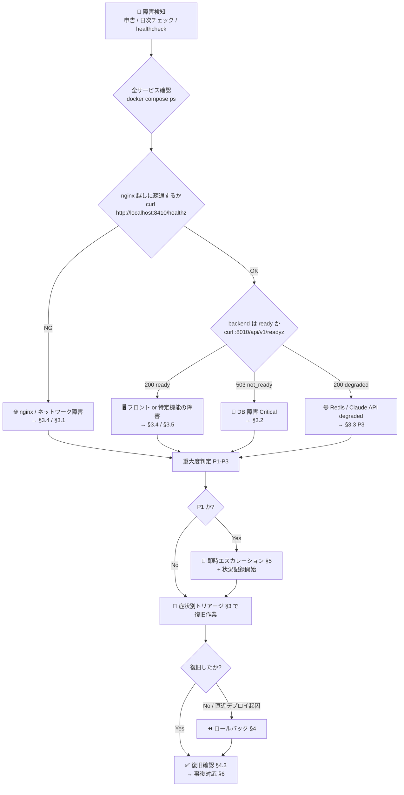

# 📌 INCIDENT_RESPONSE — 障害対応手順書

> Construction-LegalOps-DX の障害検知から復旧・事後対応までの手順書。
> 確認コマンドはすべて実装済みエンドポイント (`backend/app/main.py` / `backend/app/api/v1/health.py`) と
> compose 構成 (`infra/docker/docker-compose.yml`) に基づく。

| 項目 | 内容 |
|---|---|
| 👥 対象読者 | 障害一次対応者 (運用担当)・インフラ担当者・開発担当者 |
| 🏗️ 前提 | **本番未リリース**。Docker Compose オンプレ構成。**CD (自動デプロイ) は存在せず、復旧・ロールバックはすべて手動** |
| 📄 関連文書 | `docs/OPERATIONS.md` (起動/停止/ログ) / `docs/MONITORING.md` (エンドポイント仕様) / `docs/BACKUP_RESTORE.md` (リストア) |

> ⚠️ **未整備**: アラート自動通知 (Slack / メール / PagerDuty 等) は未構築のため、現状の障害検知は
> **利用者からの申告・日次チェック (`docs/OPERATIONS.md` §6)・healthcheck の目視確認**に依存する
> (Issue 未起票 — 起票推奨)。

---

## 📌 1. 重大度定義

| 重大度 | 定義 | 例 | 初動目標 | 対応体制 |
|---|---|---|---|---|
| 🔴 **P1** | サービス全停止・データ破損/漏洩の疑い・セキュリティインシデント | 全 API が 5xx、DB データ消失、secrets 漏洩 | 即時 (業務時間内 15 分以内) | 全員招集 + エスカレーション必須 |
| 🟠 **P2** | 主要機能の障害 (回避策なし)・著しい性能劣化 | 契約書レビュー機能不能、認証不能、応答が恒常的に数十秒 | 1 時間以内 | 一次対応者 + 開発担当 |
| 🟡 **P3** | 部分的な障害 (回避策あり)・degraded 状態 | Redis 停止 (readyz は degraded で稼働継続)、AI レビューのみ不能 | 1 営業日以内 | 一次対応者 |

> 📊 初動目標時間は**本番未リリースのため暫定値**。リリース後の運用実績と SLA 合意に基づき見直すこと。

---

## 📌 2. 初動フロー



**初動で必ず記録すること** (ポストモーテムの入力になる):

- ⏱ 検知日時・検知経路
- 📊 影響範囲 (全体 / 特定機能 / 特定ユーザー)
- 📝 `docker compose -f infra/docker/docker-compose.yml ps` の出力
- 📝 該当サービスの直近ログ (`logs --tail=200`)
- 🔀 直近のデプロイ / merge の有無 (`git log --oneline -5`)

---

## 📌 3. 症状別トリアージ

> 💡 エンドポイントの正確な挙動 (どこまで何を確認するか) は `docs/MONITORING.md` §2 を参照。
> 以下のポートは開発/ステージング値 (`docs/PORT_ALLOCATION.md`)。本番は nginx (80/443) 越しのみ。

### 3.1 🔴 API が 5xx を返す

```bash
# 1. 生存確認 (プロセス応答のみ)
curl -sv http://localhost:8010/healthz

# 2. 準備状態 (root /readyz: DB へ SELECT 1。失敗なら 503)
curl -sv http://localhost:8010/readyz

# 3. deep check (DB=Critical, Redis/Claude=Optional の内訳が JSON で返る)
curl -s http://localhost:8010/api/v1/readyz | jq .

# 4. backend ログでエラー内容と request_id を特定
docker compose -f infra/docker/docker-compose.yml logs --tail=200 backend
docker compose -f infra/docker/docker-compose.yml logs --no-log-prefix backend | jq -c 'select(.level == "error")'

# 5. メトリクスで 5xx の量と対象パスを確認 (http_requests_total の status ラベル)
curl -s http://localhost:8010/metrics | grep 'http_requests_total' | grep 'status="5'
```

| 切り分け結果 | 次アクション |
|---|---|
| `/healthz` 自体が応答しない | backend コンテナ停止/クラッシュ → `docker compose ps` / `logs` → 再起動 |
| `/healthz` OK・`/readyz` 503 | DB 障害 → §3.2 |
| `/readyz` OK・特定 API のみ 5xx | アプリバグの可能性 → ログの traceback 確認 → 直近デプロイ起因ならロールバック §4 |
| 直近デプロイ直後から発生 | ロールバック §4 を優先 |

### 3.2 🐘 DB (PostgreSQL) 接続不能

**症状**: `/readyz` が 503、backend ログに `readyz_db_failure`、API が 5xx。

```bash
# 1. postgres コンテナと healthcheck の状態
docker compose -f infra/docker/docker-compose.yml ps postgres
docker compose -f infra/docker/docker-compose.yml logs --tail=100 postgres

# 2. コンテナ内から直接疎通確認 (dev 既定: ユーザー legalops / DB legalops)
docker compose -f infra/docker/docker-compose.yml exec postgres pg_isready -U legalops -d legalops

# 3. 接続数・ロック状況の確認
docker compose -f infra/docker/docker-compose.yml exec postgres \
  psql -U legalops -d legalops -c "SELECT count(*) FROM pg_stat_activity;"

# 4. ディスク枯渇の確認 (pgdata volume)
docker system df
df -h
```

| 原因 | 対処 |
|---|---|
| コンテナ停止 | `docker compose -f infra/docker/docker-compose.yml up -d postgres` (restart: unless-stopped だが手動停止後は再起動しない) |
| ディスク枯渇 | ログ/不要イメージ削除 (`docker system prune` は影響確認の上で) → 再起動 |
| データ破損疑い | 🚨 **P1**。即エスカレーション → `docs/BACKUP_RESTORE.md` のリストア手順 |
| 認証エラー (本番) | `POSTGRES_PASSWORD` / `DB_URL` の Vault 値と環境変数の不一致を確認 |

### 3.3 🔴 Redis 障害

**症状**: `/api/v1/readyz` が 200 だが `"status": "degraded"`、warnings に `redis`。
backend ログに `readyz_degraded`。**DB と異なり Critical ではない** — API 本体は稼働継続する。
影響範囲: キャッシュ + Celery broker/result backend (契約書解析等の非同期ジョブが滞留する)。

```bash
# 1. コンテナ状態とログ
docker compose -f infra/docker/docker-compose.yml ps redis
docker compose -f infra/docker/docker-compose.yml logs --tail=100 redis

# 2. 直接 ping (dev。本番は --requirepass 必須のため -a "$REDIS_PASSWORD" を付与)
docker compose -f infra/docker/docker-compose.yml exec redis redis-cli ping

# 3. メモリ状況 (本番は maxmemory 512mb / allkeys-lru)
docker compose -f infra/docker/docker-compose.yml exec redis redis-cli info memory

# 4. Celery worker が broker に繋がっているか (--profile worker 稼働時)
docker compose -f infra/docker/docker-compose.yml --profile worker logs --tail=100 celery-worker
```

対処: 再起動 (`up -d redis`) → `/api/v1/readyz` が `ready` に戻ることを確認 → celery-worker の再接続をログで確認。
キャッシュは失われても業務データに影響なし (正本は PostgreSQL — `docs/BACKUP_RESTORE.md` §2)。

### 3.4 🖥️ フロントエンドが表示できない

```bash
# 1. nginx 自身は生きているか (nginx が直接 200 "ok" を返す)
curl -sv http://localhost:8410/healthz

# 2. frontend コンテナ直接 (dev: 3010)
curl -sv http://localhost:3010/
docker compose -f infra/docker/docker-compose.yml ps frontend
docker compose -f infra/docker/docker-compose.yml logs --tail=100 frontend

# 3. nginx のプロキシエラー確認 (upstream: frontend:3000 / max_fails=3 fail_timeout=30s)
docker compose -f infra/docker/docker-compose.yml logs --tail=100 nginx
```

| 切り分け結果 | 原因候補 |
|---|---|
| nginx `/healthz` NG | nginx 停止 / ポート競合 (`docs/PORT_ALLOCATION.md` の共存ホスト事情) → nginx 再起動 |
| nginx OK・frontend 直接 NG | Next.js クラッシュ → frontend ログ確認 → 再起動 / 再ビルド |
| 表示は出るが API 呼び出しが失敗 | `NEXT_PUBLIC_API_URL` / `NEXT_PUBLIC_API_BASE_URL` の焼き込み不整合 (**ビルド時に確定**するため、環境変数変更後は frontend の**再ビルドが必須** — `docs/PORT_ALLOCATION.md` §3 変数モデル参照) |
| 502/504 が nginx ログに出る | upstream (backend/frontend) の healthcheck 状態を確認 → §3.1 へ |

### 3.5 🔐 認証障害 (ログイン不能)

```bash
# 1. auth 系エンドポイントの応答確認 (nginx はレート制限 auth_limit: 10r/m burst=5 を適用)
docker compose -f infra/docker/docker-compose.yml logs nginx | grep -E "limiting requests|/api/(auth|login|token)"

# 2. backend ログで認証エラーの内訳確認
docker compose -f infra/docker/docker-compose.yml logs --no-log-prefix backend | jq -c 'select(.level == "error" or .level == "warning")'
```

| 原因候補 | 確認ポイント |
|---|---|
| レート制限 (総当たり防御の誤発動) | nginx ログの `limiting requests`。正当ユーザーなら発生元 IP を確認 |
| JWT 鍵不整合 | 本番: Vault の `secret/legalops/jwt` と環境変数 `JWT_PRIVATE_KEY`/`JWT_PUBLIC_KEY` の一致 (`scripts/setup_vault_secrets.sh`) |
| Entra ID (SSO) 側障害 | `ENTRA_TENANT_ID` / `ENTRA_CLIENT_ID` / `ENTRA_CLIENT_SECRET` の設定、Microsoft 側のサービス正常性 |
| クライアントシークレット期限切れ | Entra ID アプリ登録のシークレット有効期限 |

> 🚨 認証障害が**セキュリティインシデント (不正アクセス・鍵漏洩) の疑い**を伴う場合は P1 として即エスカレーションし、`docs/security_policy.md` に従う。

---

## 📌 4. ロールバック手順

> 🚨 **前提: CD が無いため、ロールバックは「git revert → 手動再ビルド → 手動再デプロイ」である。**
> `CLAUDE.md` の禁止事項により **force push / 履歴改変は禁止** — 必ず `git revert` で戻す。

### 4.1 ⏪ アプリケーションのロールバック

```bash
# 1. 問題のコミット/マージを特定
git log --oneline -10

# 2. revert コミットを作成 (merge commit の場合は -m 1)
git revert <commit-sha>            # 通常コミット
git revert -m 1 <merge-sha>        # マージコミット

# 3. PR 経由で main へ反映 (main 直接 push 禁止のため)
#    緊急時も branch → PR → CI 通過 → merge の順を守る

# 4. 本番サーバーで再ビルド・再デプロイ (手動)
git pull origin main
docker compose -f infra/docker/docker-compose.yml -f infra/docker/docker-compose.prod.yml --profile worker build
docker compose -f infra/docker/docker-compose.yml -f infra/docker/docker-compose.prod.yml --profile worker up -d
```

### 4.2 🐘 DB マイグレーションのロールバック

```bash
# 現在のリビジョン確認
docker compose -f infra/docker/docker-compose.yml exec backend alembic current

# 1 リビジョン戻す (docs/RELEASE_CHECKLIST.md §4 — 事前にステージングで検証済みであること)
docker compose -f infra/docker/docker-compose.yml exec backend alembic downgrade -1
```

> ⚠️ downgrade でデータが失われるマイグレーションもある。実行前に必ず `docs/BACKUP_RESTORE.md` §3 でバックアップを取得すること。データ復旧が必要な場合はリストア手順 (同 §4) へ。

### 4.3 ✅ ロールバック後の復旧確認

```bash
docker compose -f infra/docker/docker-compose.yml ps          # 全サービス healthy
curl -sf http://localhost:8410/healthz                        # nginx
curl -s  http://localhost:8010/api/v1/readyz | jq .status     # "ready"
curl -s  http://localhost:8010/metrics | grep 'status="5'     # 5xx が増えていないこと
```

障害の原因となった操作 (画面/API) を実際に再実行して正常化を確認する。

---

## 📌 5. エスカレーション基準

| 条件 | エスカレーション先 | 期限 |
|---|---|---|
| 🔴 P1 判定 (全停止 / データ破損・漏洩疑い / セキュリティ) | プロジェクト責任者 + インフラリード (+ セキュリティ事案は法務リード) | 即時 |
| 🟠 P2 が初動 1 時間で復旧見込み立たず | 開発担当 (アプリ起因) / インフラリード (基盤起因) | 1 時間 |
| 🔁 同一原因の障害が 2 回再発 | 開発担当 — 恒久対策を Issue 化 (場当たり修復の繰り返し禁止 — `CLAUDE.md` Error Control) | 再発時点 |
| 🔐 週次 security scan (`security.yml`) で CRITICAL 検出 | セキュリティ担当 + プロジェクト責任者 | 検出当日 |
| 💾 リストアが必要になった | インフラリード (単独判断でのリストア実行禁止) | 即時 |

> ⚠️ **未整備**: 具体的な連絡先一覧・オンコール当番表・連絡手段 (電話/Slack) は未整備
> (本番未リリースのため体制未確定。**リリース前に必ず整備し本表を実名で更新すること**。Issue 未起票 — 起票推奨)。

---

## 📌 6. 事後対応 (ポストモーテム)

### 6.1 📋 Issue 起票 (必須)

P1/P2 の全件、P3 は再発性があるものについて、復旧後 1 営業日以内に GitHub Issue を起票する。

```bash
gh issue create \
  --title "incident: <概要> (P1|P2|P3)" \
  --body "$(cat <<'EOF'
## 📊 概要
- 検知日時 / 復旧日時 / 影響時間:
- 重大度: P1 / P2 / P3
- 影響範囲:

## 🔍 タイムライン
- HH:MM 検知 (経路)
- HH:MM 初動
- HH:MM 復旧

## 🐛 根本原因
(原因不明のまま closed にしない — 原因不明修正は禁止)

## 🔧 恒久対策 (Completion Criteria)
- [ ] 再発防止策
- [ ] 検知改善 (監視・アラート)
- [ ] テスト追加
EOF
)"
```

### 6.2 📝 ポストモーテムの原則

- ✅ **非難しない (blameless)** — 個人ではなく仕組みの欠陥に焦点を当てる
- 🔍 「なぜ検知が遅れたか」を必ず問う → `docs/MONITORING.md` の未整備項目 (アラート等) の解消につなげる
- 🧪 再発防止策は**テストまたは自動チェックに落とす** (受入れ基準をテストへ — `CLAUDE.md` 設計原則)
- 📊 P1 は再発防止策完了まで Issue を close しない
- 📚 障害パターンは `state.json` の `learning.failure_patterns` にも記録する (ClaudeOS 運用)

### 6.3 📄 記録の保管

- ポストモーテムの正本は GitHub Issue (ラベル `incident` を付与 — ⚠️ ラベル自体は未作成のため初回に作成する)
- 監査要件 (`docs/audit_log_policy.md`) に関わる事案は Audit-Agent の証跡確認対象に含める
