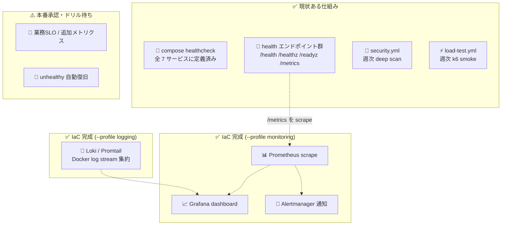

# 📌 MONITORING — 監視手順書

> Construction-LegalOps-DX の監視対象・エンドポイント仕様・メトリクス・アラート方針。
> エンドポイントの挙動はすべて実装 (`backend/app/main.py` / `backend/app/api/v1/health.py`) を読んで記載している。

| 項目 | 内容 |
|---|---|
| 👥 対象読者 | 運用担当者・インフラ担当者・監視基盤の構築担当者 |
| 🏗️ 前提 | **本番未リリース**。Docker Compose オンプレ構成。**Prometheus / Alertmanager / Grafana は IaC 設定完成** (--profile monitoring で起動可)。`infra/monitoring/` 配下に設定一式あり |
| 📄 関連文書 | `docs/OPERATIONS.md` (ログの見方) / `docs/INCIDENT_RESPONSE.md` (異常検知後の対応) / `docs/PORT_ALLOCATION.md` (ポート) |

---

## 📌 1. 監視レイヤーの全体像



---

## 📌 2. 監視対象一覧 — エンドポイントの正確な挙動

backend (FastAPI) が公開する監視用エンドポイント。実装箇所を併記する。

| エンドポイント | 実装 | 何を確認するか | 正常応答 | 異常応答 |
|---|---|---|---|---|
| 🫀 `GET /health` | `main.py` | **生存のみ** (依存確認なし) | `200 {"status":"ok"}` | プロセス無応答 |
| 🫀 `GET /healthz` | `main.py` | **生存のみ**。`/health` と同一挙動。**compose の backend healthcheck が使用** | `200 {"status":"ok"}` | プロセス無応答 |
| 🏥 `GET /readyz` | `main.py` (root 版) | DB へ `SELECT 1` を実行 (**DB のみ**) | `200 {"status":"ready","db":"ok"}` | DB 失敗 → `503 {"status":"not_ready"}` |
| 🏥 `GET /api/v1/readyz` | `api/v1/health.py` (**deep check**) | **DB (Critical) + Redis (Optional) + Claude API キー設定 (Optional)**。各チェック 3 秒タイムアウト | `200 {"status":"ready","checks":{...},"warnings":[]}` / Redis 等失敗時は `200 {"status":"degraded","warnings":["redis",...]}` | **DB 失敗のみ** `503 {"status":"not_ready","checks":{...}}` |
| 🫀 `GET /api/v1/healthz` | `api/v1/health.py` | 生存のみ | `200 {"status":"ok"}` | — |
| 🫀 `GET /api/v1/health` | `main.py` | 生存 + バージョン | `200 {"status":"ok","version":"0.1.0"}` | — |
| 🏓 `GET /api/v1/ping` | `api/v1/health.py` | 最軽量の疎通確認 | `200 {"status":"pong"}` | — |
| 📊 `GET /metrics` | `main.py` | Prometheus 形式メトリクス (§3) | `200` (text/plain; Prometheus exposition format) | — |
| 🌐 `GET /healthz` (nginx) | `infra/nginx/default.conf` | **nginx 自身の生存** (`return 200 "ok"` — backend へは行かない。access_log off) | `200 ok` | nginx 停止 |

> 💡 **使い分けの要点**:
> - liveness (再起動判断) には `/healthz`、readiness (トラフィック投入判断・障害切り分け) には `/api/v1/readyz` を使う
> - `/api/v1/readyz` の `degraded` は**稼働継続** — Redis / Claude API は Optional 依存 (503 になるのは DB 失敗時のみ)
> - Claude API チェックは `CLAUDE_API_KEY` の**設定有無のみ**確認 (probe 毎の実 API 呼び出しはしない設計)
> - `/health` `/healthz` `/readyz` `/metrics` は `include_in_schema=False` のため OpenAPI (`/docs`) には出ない

### 2.1 🐳 compose healthcheck (常時自動実行されている監視)

`infra/docker/docker-compose.yml` に定義済み。`docker compose ps` の `(healthy)` 表示が結果。

| サービス | チェック内容 | 間隔 |
|---|---|---|
| postgres | `pg_isready -U legalops -d legalops` | 10s |
| redis | `redis-cli ping` | 10s |
| backend | Python urllib で `http://localhost:8000/healthz` が 200 | 15s |
| frontend | `wget http://localhost:3000/` | 15s |
| nginx | `wget http://localhost/healthz` | 15s |
| celery-worker | `celery -A app.worker.celery_app inspect ping` | 30s |
| celery-beat | `pgrep -f 'celery.*beat'` (プロセス存在のみ) | 30s |

> ⚠️ healthcheck が fail してもコンテナは**自動再起動されない** (restart: unless-stopped はプロセス終了時のみ)。
> `unhealthy` の検知 → `scripts/check_unhealthy_services.sh` の report-only と人間承認後 restart で対応する。

---

## 📌 3. Prometheus メトリクス (実装確認済み)

`backend/app/main.py` は HTTP 指標用の専用 `CollectorRegistry` と default registry の運用指標を結合し、
`RequestContextMiddleware` (pure-ASGI) と `app.observability.operational_metrics` が `GET /metrics` で公開する。

| メトリクス | 型 | ラベル | 内容 |
|---|---|---|---|
| 📈 `http_requests_total` | Counter | `method` / `path` / `status` | 処理した HTTP リクエスト総数 |
| ⏱ `http_request_duration_seconds` | Histogram | `method` / `path` | リクエストレイテンシ (秒)。Histogram 既定バケット |
| 🧩 `db_pool_size` / `db_pool_available` | Gauge | なし | asyncpg pool の設定サイズ / idle 接続数 |
| 🚨 `db_commit_failures_total` / `db_connection_errors_total` | Counter | なし | commit-after-response 窓と DB 接続障害の検知 |
| 📄 `legalops_contracts_by_status` | Gauge | `status` | 契約件数を status 別に集計 |
| 🧑‍⚖️ `legalops_legal_reviews_by_status` | Gauge | `status` | 法務レビュー件数を status 別に集計 |
| 🔁 `legalops_workflow_steps_by_status` | Gauge | `status` | ワークフローステップ件数を status 別に集計 |
| 📢 `legalops_notifications_by_status` | Gauge | `status` | 通知件数を status 別に集計 |
| 🧵 `celery_queue_length` | Gauge | `queue` | Redis-backed Celery queue 長。Redis 不通時は `-1` |

実装上の特性 (運用で効いてくるポイント):

- ✅ `path` ラベルは **route テンプレート** (例: `/api/v1/contracts/{id}`) を優先使用 — ID によるカーディナリティ爆発を回避
- ✅ メトリクス記録の失敗はリクエストを壊さない (例外は debug ログに落とすのみ)
- ⚠️ レジストリは**プロセス単位**。本番 overlay では backend が `replicas: 2` のため、**各レプリカの `/metrics` を個別に scrape して集計する必要がある** (multiprocess 集約は未実装)
- ✅ DB プール・Celery キュー長・ビジネスメトリクス (契約/レビュー/ワークフロー/通知 status 別件数) は実装済み
- ⚠️ Celery queue 長は Redis から `LLEN` で取得する。Redis 不通時は `/metrics` 自体を落とさず `celery_queue_length=-1` を出す

確認コマンド (dev):

```bash
curl -s http://localhost:8010/metrics | grep -E '^http_requests_total'
curl -s http://localhost:8010/metrics | grep -E '^http_request_duration_seconds_(count|sum)'
curl -s http://localhost:8010/metrics | grep -E '^(db_pool_|legalops_|celery_queue_length)'
```

---

## 📌 4. 推奨アラート閾値

> 🚨 **アラート設定は IaC 完成済み** (`infra/monitoring/alert.rules.yml` / `alertmanager.yml`)。
> 以下は初期推奨値であり、稼働実績に基づく値ではない。
> 実測に基づく閾値は**リリース後に計測して記入**すること。

| # | 対象 | 推奨条件 (案) | 重大度 | 根拠 |
|---|---|---|---|---|
| 1 | 🫀 生存 | `/healthz` 無応答 or nginx `/healthz` 無応答が 1 分継続 | 🔴 P1 | サービス全停止相当 |
| 2 | 🏥 readiness | `/api/v1/readyz` が 503 (DB Critical) が 1 分継続 | 🔴 P1 | DB は唯一の Critical 依存 (実装仕様) |
| 3 | 🟡 degraded | `/api/v1/readyz` が `degraded` が 15 分継続 | 🟡 P3 | Redis/Claude は Optional だが Celery ジョブ滞留につながる |
| 4 | 📈 エラー率 | `http_requests_total{status=~"5.."}` の割合 > 5% (5 分間) | 🟠 P2 | 一般的な初期値。**実測後に見直し** |
| 5 | ⏱ レイテンシ | `http_request_duration_seconds` の p95 > 2s (5 分間) | 🟠 P2 | k6 (`infra/k6/load-test.js`) の SLO threshold と整合させること。**実測後に見直し** |
| 6 | 💾 ディスク | pgdata ボリュームのあるファイルシステム使用率 > 80% | 🟠 P2 | DB 停止の予防 |
| 7 | 🐳 healthcheck | `docker compose ps` に `unhealthy` が出現 | 🟠 P2 | §2.1 のとおり自動復旧しないため |

アラート発報時の対応は `docs/INCIDENT_RESPONSE.md` の症状別トリアージへ接続する。

---

## 📌 5. 監視基盤 (Prometheus / Grafana) — IaC 完成・起動待ち

> ✅ **Prometheus・Grafana・Alertmanager はリポジトリに存在する**。
> `infra/docker/docker-compose.yml` の `monitoring` profile と `infra/monitoring/` 配下の設定で起動できる。
> 本番リリース前に通知先 secret / URL を投入し、ステージングで発報ドリルを 1 回実施すること。

### 5.1 🔧 構築時の接続方法 (指針)

1. `monitoring` profile で監視サービスを起動する:

   ```bash
   docker compose -f infra/docker/docker-compose.yml --profile monitoring up -d prometheus alertmanager grafana
   ```

2. Prometheus の scrape 対象は Docker 内部名で指定済み — backend はコンテナ内部ポート **8000**:

   ```yaml
   # infra/monitoring/prometheus.yml
   scrape_configs:
     - job_name: legalops-backend
       metrics_path: /metrics
       static_configs:
         - targets: ["backend:8000"]
   ```

3. ⚠️ 本番 overlay では backend が `replicas: 2` かつ `container_name` 解除のため、必要に応じて
   `dns_sd_configs` (compose のサービス名 DNS ラウンドロビン) 等で全レプリカを発見する構成にする
4. ホスト公開ポートを追加する場合は `docs/PORT_ALLOCATION.md` の割当表に**必ず追記**する (共存ホストのため衝突注意)
5. `/metrics` は認証なしで公開されているため、監視基盤構築時に **nginx で外部からの `/metrics` アクセスを遮断**する
   (現状 nginx は `/api/` と `/` のみプロキシしており `/metrics` は外部公開されていないが、backend ポート直結時は注意)

### 5.2 📝 ログ集約

- Loki / Promtail の IaC は完成済み。`infra/monitoring/loki-config.yml` と
  `infra/monitoring/promtail-config.yml` を `--profile logging` で起動できる。
- backend は structlog の JSON を stdout に出すため (`docs/OPERATIONS.md` §4.1)、
  Promtail が Docker log stream を Loki へ転送する。
- 本番では Docker socket read-only mount を使うため、運用承認とホスト権限レビュー後に起動する。

```bash
docker compose -f infra/docker/docker-compose.yml --profile logging up -d loki promtail
```

---

## 📌 6. 週次スキャンの位置づけ (既に自動実行されている監視)

監視基盤が無い現状、**GitHub Actions の 2 つの schedule 実行が唯一の自動・定期監視**である。
結果確認は運用の週次チェック (`docs/OPERATIONS.md` §6.2) に組み込まれている。

### 6.1 🔐 weekly security scan (`.github/workflows/security.yml`)

| 項目 | 内容 |
|---|---|
| トリガー | schedule `cron: "0 18 * * 1"` (UTC) + `workflow_dispatch` (手動) + 同ファイル変更時の push |
| ジョブ | Bandit (Python SAST, SARIF)、Trivy fs (vuln/secret/misconfig — CRITICAL/HIGH で fail)、pip-audit (lockfile 解決方式)、npm audit (high+)、Trivy image (backend/frontend イメージ) |
| 位置づけ | **依存脆弱性・秘匿情報混入・設定ミスの定期検知**。PR 毎の `ci.yml` security ジョブ (Bandit+Trivy fs の軽量版) より深い |
| 結果確認 | `gh run list --workflow=security.yml --limit 1`。各ジョブの JSON/SARIF レポートは Actions artifact に保全 |
| 検知時 | CRITICAL/HIGH → `docs/INCIDENT_RESPONSE.md` §5 のエスカレーション基準に従い当日対応 |

### 6.2 ⚡ k6 load test (`.github/workflows/load-test.yml`)

| 項目 | 内容 |
|---|---|
| トリガー | schedule `cron: "0 17 * * 0"` (UTC) の週次 smoke + `workflow_dispatch` (scenario: smoke / load / soak、base_url 指定可) |
| 実行方式 | **CI ランナー内**に PostgreSQL 16 + uvicorn backend を起動し、`infra/k6/load-test.js` を実行 (`AUTH_DEV_BYPASS=true`) |
| 位置づけ | **性能リグレッションの早期検知** (SLO threshold 違反で k6 が非 0 終了 → run 失敗として現れる)。**本番環境の実負荷監視ではない** |
| 結果確認 | `gh run list --workflow=load-test.yml --limit 1`。`k6-results.json` が artifact に保存される |

> ⚠️ 本番リリース後は、CI ランナー内ではなく**ステージング/本番相当環境**への `workflow_dispatch` (base_url 指定) 実行を検討すること。

---

## 📌 7. 未整備事項サマリー (正直な現状)

| 項目 | 状態 | 追跡 |
|---|---|---|
| 📊 Prometheus / Grafana / Alertmanager | ✅ IaC 完成 (`--profile monitoring`) | 本番通知先投入と発報ドリル待ち |
| 🚨 アラート自動通知 (Slack / メール等) | ⏳ Alertmanager 設定あり。通知先 secret は本番投入待ち | リリース前に通知先と当番表を確定 |
| 📝 ログ集約基盤 (Loki / Promtail) | ✅ IaC 完成 (`--profile logging`) | 本番ホスト権限レビューと起動ドリル待ち |
| 📈 実測ベースの SLO / 閾値 | ⏳ 本番未リリースのため実測値なし — **リリース後に計測して記入** | — |
| 🔢 追加メトリクス (DB プール / Celery キュー / ビジネス指標) | ✅ 実装済み | `/metrics` contract test で露出確認済み。実測SLOはリリース後に調整 |
| 🐳 unhealthy コンテナの復旧 | ✅ 手動承認型 watchdog 整備済み | `docs/UNHEALTHY_RECOVERY_REVIEW.md` / `scripts/check_unhealthy_services.sh`。常駐 autoheal は security 理由で不採用 |
