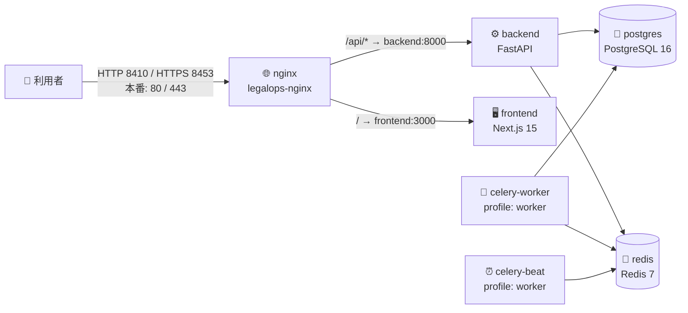

# 📌 OPERATIONS — 運用手順書

> Construction-LegalOps-DX の日常運用手順書。
> すべてのコマンドはリポジトリの実体 (`infra/docker/docker-compose.yml` / `docker-compose.prod.yml` /
> `infra/nginx/*.conf` / `backend/app/main.py` / `scripts/`) に基づく。

| 項目 | 内容 |
|---|---|
| 👥 対象読者 | インフラ担当者・運用担当者・オンコール対応者 |
| 🏗️ 前提 | **本番未リリース**。Docker Compose によるオンプレ構成。Cloudflare/Neon 移行の IaC コード完成（`infra/cloudflare/`）。監視基盤（Prometheus/Alertmanager/Grafana）設定完成（`--profile monitoring`） |
| 📄 関連文書 | `docs/PORT_ALLOCATION.md` / `docs/RELEASE_CHECKLIST.md` / `docs/INCIDENT_RESPONSE.md` / `docs/MONITORING.md` / `docs/BACKUP_RESTORE.md` |

---

## 📌 1. サービス構成の全体像



| サービス | コンテナ名 (dev) | イメージ | ホスト公開ポート (dev) | healthcheck |
|---|---|---|---|---|
| 🐘 postgres | `legalops-postgres` | `postgres:16-alpine` | `5442` → 5432 | `pg_isready` |
| 🔴 redis | `legalops-redis` | `redis:7-alpine` | `6392` → 6379 | `redis-cli ping` |
| ⚙️ backend | `legalops-backend` | `construction-legalops-dx/backend:dev` | `8010` → 8000 | `GET /healthz` (HTTP 200) |
| 🖥️ frontend | `legalops-frontend` | `construction-legalops-dx/frontend:dev` | `3010` → 3000 | `wget http://localhost:3000/` |
| 🌐 nginx | `legalops-nginx` | `nginx:1.27-alpine` | `8410` / `8453` (本番: 80 / 443) | `GET /healthz` |
| 🔁 celery-worker | `legalops-celery-worker` | backend と同一 | なし (`--profile worker` で起動) | `celery inspect ping` |
| ⏰ celery-beat | `legalops-celery-beat` | backend と同一 | なし (`--profile worker` で起動) | `pgrep celery.*beat` |

> ⚠️ **本番 overlay 適用時の注意**: `docker-compose.prod.yml` は backend / frontend / celery-worker を
> `replicas: 2` にするため `container_name` を解除する。本番ではコンテナ名指定 (`legalops-backend` 等) ではなく
> **`docker compose ... exec <サービス名>` / `docker compose ... logs <サービス名>`** を使うこと。
> また postgres / redis / backend / frontend のホスト公開ポートは本番では**すべて閉鎖**され、公開は nginx (80/443) のみ。

ポート割当の詳細と背景 (マルチプロジェクト共存ホスト) は `docs/PORT_ALLOCATION.md` を参照。

---

## 📌 2. サービスの起動 / 停止 / 再起動

すべて**リポジトリルート**から実行する。

### 2.1 ✅ 起動 (開発 / ステージング — base compose のみ)

```bash
# 前提: リポジトリルートに .env が存在すること (env_file: ../../.env で参照される)
# 無い場合は .env.example をコピーして作成する
cp -n .env.example .env

# コアサービス起動 (postgres / redis / backend / frontend / nginx)
docker compose -f infra/docker/docker-compose.yml up -d

# Celery worker / beat も起動する場合 (--profile worker)
docker compose -f infra/docker/docker-compose.yml --profile worker up -d
```

### 2.2 🚀 起動 (本番 — prod overlay 適用)

```bash
docker compose \
  -f infra/docker/docker-compose.yml \
  -f infra/docker/docker-compose.prod.yml \
  --profile worker up -d
```

prod overlay が変えること (`infra/docker/docker-compose.prod.yml` の実装):

| 項目 | base (dev) | prod overlay |
|---|---|---|
| 🔐 秘匿値 | デフォルト値あり (`legalops_dev` 等) | `${VAR:?required in production}` で**未設定なら起動失敗 (fail-fast)** |
| 🌐 公開ポート | 各サービスをホスト公開 | 直接公開時は **nginx の 80/443 のみ**。Cloudflare Tunnel 採用時は `docker-compose.cloudflare-tunnel.yml` overlay で nginx host ports を閉じ、cloudflared が `nginx:80` に接続。postgres / redis / backend / frontend は internal |
| 📊 リソース | 制限なし | 全サービスに memory / cpus の limits・reservations |
| 🔁 冗長化 | 各 1 コンテナ | backend / celery-worker / frontend は `replicas: 2` |
| 🛡️ 堅牢化 | — | backend / frontend / celery-worker は `read_only: true` + tmpfs |
| 📝 ログ | Docker 既定 | `json-file` + rotation (`max-size: 20m` × `max-file: 5`) |
| 🔴 Redis | パスワードなし | `--requirepass ${REDIS_PASSWORD}` + `--maxmemory 512mb` |

prod overlay で**必須**の環境変数 (未設定だと `docker compose config` 段階でエラー):
`POSTGRES_USER` / `POSTGRES_PASSWORD` / `POSTGRES_DB` / `DB_URL` / `REDIS_URL` / `REDIS_PASSWORD` /
`CELERY_BROKER_URL` / `CELERY_RESULT_BACKEND` / `JWT_SECRET` / `ENTRA_TENANT_ID` / `ENTRA_CLIENT_ID` /
`ENTRA_CLIENT_SECRET` / `CLAUDE_API_KEY` / `HENNGE_TENANT_ID` / `HENNGE_API_KEY` / `NEXT_PUBLIC_API_BASE_URL`

起動前の構文検証 (CI の `docker-build` ジョブと同じ手順):

```bash
docker compose -f infra/docker/docker-compose.yml -f infra/docker/docker-compose.prod.yml config >/dev/null
```

### 2.3 ⏹️ 停止

```bash
# コンテナ停止のみ (データ・コンテナは保持)
docker compose -f infra/docker/docker-compose.yml stop

# コンテナ・ネットワーク削除 (named volume: legalops-pgdata / legalops-redisdata は保持)
docker compose -f infra/docker/docker-compose.yml down
```

> 🚨 **`down -v` は禁止**。named volume (`legalops-pgdata` = PostgreSQL 業務データ正本) が削除される。
> 実行が必要な場合は必ず事前に `docs/BACKUP_RESTORE.md` の手順でバックアップを取得すること。

### 2.4 🔄 再起動

```bash
# 単一サービスの再起動 (例: backend)
docker compose -f infra/docker/docker-compose.yml restart backend

# コード変更を反映する再起動 (イメージ再ビルド → 再作成)
docker compose -f infra/docker/docker-compose.yml build backend
docker compose -f infra/docker/docker-compose.yml up -d backend
```

### 2.5 📊 状態確認

```bash
# 全サービスの状態と healthcheck 結果
docker compose -f infra/docker/docker-compose.yml ps

# backend の生存・準備状態 (エンドポイントの正確な挙動は docs/MONITORING.md 参照)
curl -s http://localhost:8010/healthz    # {"status":"ok"}
curl -s http://localhost:8010/readyz     # {"status":"ready","db":"ok"} — DB 到達不能なら 503

# nginx 経由 (dev: 8410)
curl -s http://localhost:8410/healthz    # "ok" (nginx 自身が返す)
```

### 2.6 🐳 unhealthy 検知と復旧ドリル

Docker Compose の healthcheck は `unhealthy` を検知するが、`restart: unless-stopped` は
プロセス終了時のみ効くため、`unhealthy` だけでは自動再起動しない。

```bash
# report-only。unhealthy があれば exit 1 で一覧表示する
./scripts/check_unhealthy_services.sh

# Incident Commander / Infra Lead 承認後に単一 service を restart
./scripts/check_unhealthy_services.sh --restart backend
```

CTO 判断: Docker socket を持つ常駐 autoheal コンテナは host root 相当の攻撃面を増やすため、
現時点では採用しない。詳細は `docs/UNHEALTHY_RECOVERY_REVIEW.md` を参照。

---

## 📌 3. 環境変数 / Secrets の投入手順

### 3.1 🔧 開発環境 (.env)

- リポジトリルートの `.env` に設定する (`.env.example` がテンプレート)
- compose の `env_file: - ../../.env` で backend / frontend / celery-* に注入される
- ⚠️ `docker compose -f infra/docker/docker-compose.yml` の `${VAR:-default}` 補間は
  `infra/docker/.env` を見る (通常不在 → フォールバック既定値が使われる)。詳細は `docs/PORT_ALLOCATION.md` の補足を参照

### 3.2 🔐 本番 Secrets (Vault / Azure Key Vault)

本番の秘匿値は `.env` に直接置かず、Secrets Manager で管理する (`docs/RELEASE_CHECKLIST.md` §1)。
投入は `scripts/setup_vault_secrets.sh` を使用する。

```bash
# 1. RS256 鍵ペア生成 (JWT 署名用)
./scripts/generate_rsa_keys.sh /tmp/legalops-keys

# 2a. HashiCorp Vault へ投入 (VAULT_ADDR / VAULT_TOKEN 設定済みが前提)
VAULT_MODE=hashicorp KEY_DIR=/tmp/legalops-keys ./scripts/setup_vault_secrets.sh

# 2b. または Azure Key Vault へ投入 (az login 済みが前提)
VAULT_MODE=azure AZURE_KEY_VAULT_NAME=<vault名> KEY_DIR=/tmp/legalops-keys ./scripts/setup_vault_secrets.sh
```

- スクリプトは JWT 鍵 (`secret/legalops/jwt`) を自動投入し、Entra ID / Anthropic API キーは
  **手動投入コマンドを表示するのみ** (スクリプト内にシークレット値を持たない設計)
- 投入先パス例: `secret/legalops/jwt` / `secret/legalops/entra` / `secret/legalops/anthropic`
- ⚠️ `*.pem` と `.env.production` が `.gitignore` 対象であることを必ず確認する

> ⚠️ **未整備**: 本番環境への実 secrets 投入は未実施 (**Issue #23 で追跡**)。
> Vault → コンテナ環境変数への自動注入機構 (Vault Agent 等) も未整備で、現状は Vault から取得した値を
> デプロイ時に手動で環境変数へ展開する運用となる。

### 3.3 🔑 TLS 証明書

- nginx は `/etc/nginx/certs/{fullchain.pem,privkey.pem}` を named volume `legalops-nginx-certs` から読み込む (read-only マウント)
- staging: self-signed / production: Let's Encrypt (`docs/RELEASE_CHECKLIST.md` §2)
- ✅ **IaC 完成**: certbot renewal helper は `--profile tls-renewal` で起動可能。
  `CERTBOT_DOMAINS` / `CERTBOT_EMAIL` を本番値で指定し、HTTP-01 challenge 用の
  `certbot-www` volume を nginx の `/.well-known/acme-challenge/` と共有する。
- ⚠️ 実際の証明書発行・更新開始は DNS / Cloudflare Tunnel 採否 / 本番公開方式の人間承認後に実行する。
- ⚠️ **未整備**: 本番の HTTP→HTTPS 恒久リダイレクトは `infra/nginx/default.conf` 内で**コメントアウト状態** (`# return 301 https://...`)。本番切替時にアンコメントが必要

---

## 📌 4. ログの見方

### 4.1 📝 アプリケーションログ (backend — structlog JSON)

backend は structlog で**構造化ログを stdout に出力**する (`backend/app/core/logging.py`)。

| 環境 | フォーマット |
|---|---|
| 開発 (`APP_ENV=development`) | `ConsoleRenderer` (色付き・人間可読) |
| それ以外 (production 等) | `JSONRenderer` (1 行 1 JSON、キーソート済み) |

```bash
# backend ログを追跡
docker compose -f infra/docker/docker-compose.yml logs -f backend

# JSON ログから ERROR レベルのみ抽出 (jq 使用)
docker compose -f infra/docker/docker-compose.yml logs --no-log-prefix backend | jq -c 'select(.level == "error")'

# 特定リクエストの追跡: 全ログに request_id が付与される
# (RequestContextMiddleware が X-Request-Id ヘッダを注入・レスポンスにも返す)
docker compose -f infra/docker/docker-compose.yml logs --no-log-prefix backend | grep '<request_id>'
```

主要ログイベント名 (grep キーとして使える):

| イベント | 意味 |
|---|---|
| `app_startup` / `app_shutdown` | アプリ起動・停止 |
| `app_created` | アプリ初期化完了 (cors_origins / trusted_hosts 出力) |
| `readyz_db_failure` | readiness で DB 到達不能 (Critical) |
| `readyz_degraded` | Redis / Claude API が degraded (稼働継続) |
| `api_router_unavailable` | API ルーターの import 失敗 |

> 🔒 機微情報は `SensitiveMaskingMiddleware` によりマスクされる。タイムスタンプは ISO 形式 (UTC)。

### 4.2 🌐 nginx ログ

```bash
docker compose -f infra/docker/docker-compose.yml logs -f nginx
```

- access log / error log とも標準出力 (nginx 公式イメージの既定)
- `/healthz` へのアクセスは `access_log off` のため記録されない (`infra/nginx/default.conf`)
- レート制限 (auth: 10r/m、api: 120r/m) 超過時は **503/429 系がここに記録**される

### 4.3 🐳 コンテナログ全般

```bash
# 全サービスまとめて (直近 100 行 + 追跡)
docker compose -f infra/docker/docker-compose.yml logs -f --tail=100

# postgres / redis / celery-worker 個別
docker compose -f infra/docker/docker-compose.yml logs -f postgres
docker compose -f infra/docker/docker-compose.yml logs -f redis
docker compose -f infra/docker/docker-compose.yml --profile worker logs -f celery-worker
```

- 本番は `json-file` ドライバ + rotation (**20MB × 5 世代 / サービス**) — それ以前のログは消える
- ✅ **IaC 完成**: Loki / Promtail は `--profile logging` で起動可能。
  `infra/monitoring/loki-config.yml` / `promtail-config.yml` で Docker container logs を収集する。
- ⚠️ Promtail は Docker socket を read-only mount するため、本番ホスト権限レビュー後に有効化する。

---

## 📌 5. CI/CD の使い方

> 🚨 **重要: 本プロジェクトの GitHub Actions は「検証パイプライン (CI) のみ」であり、CD (自動デプロイ) は存在しない。**
> デプロイは人間がサーバー上で `git pull` → `docker compose build` → `up -d` を手動実行する
> (`CLAUDE.md` §18 の方針どおり、本番デプロイは人間判断・手動実行)。

### 5.1 📋 ワークフロー一覧 (`.github/workflows/`)

| ワークフロー | トリガー | 内容 |
|---|---|---|
| ✅ `ci.yml` | push (main) / PR | backend (ruff / mypy / pytest)、backend-pg (PostgreSQL 16 実 DB 統合テスト)、frontend (eslint / tsc / jest)、security (Bandit / Trivy fs)、docker-build (compose 検証 + イメージビルド)、e2e (Playwright smoke) |
| 🔐 `security.yml` | 週次 schedule (`cron: 0 18 * * 1` UTC) + 手動 (`workflow_dispatch`) | Bandit (SARIF)、Trivy (fs / config / secret / image)、pip-audit、npm audit — 深いスキャン |
| ⚡ `load-test.yml` | 手動 (`workflow_dispatch`: smoke / load / soak) + 週次 schedule (`cron: 0 17 * * 0` UTC) | k6 負荷試験 (`infra/k6/load-test.js`)。CI ランナー内に backend を起動して実行 |

### 5.2 🔧 よく使う操作

```bash
# CI 実行状況の確認
gh run list --limit 5

# 失敗した run のログ確認
gh run view <run-id> --log-failed

# 負荷試験の手動実行 (シナリオ選択)
gh workflow run load-test.yml -f scenario=smoke

# 週次セキュリティスキャンの手動実行
gh workflow run security.yml
```

### 5.3 🚀 手動デプロイ手順 (本番サーバー上)

```bash
# 1. デプロイ前検証 (lint / test / SAST / Docker build を一括チェック)
./scripts/pre_deploy_check.sh        # exit 0 = 人間承認レビューへ進行可 / exit 1 = 本番承認ブロック

# 2. 最新 main を取得
git pull origin main

# 3. イメージ再ビルド + 再作成
docker compose -f infra/docker/docker-compose.yml -f infra/docker/docker-compose.prod.yml --profile worker build
docker compose -f infra/docker/docker-compose.yml -f infra/docker/docker-compose.prod.yml --profile worker up -d

# 4. DB マイグレーション (docs/RELEASE_CHECKLIST.md §4 と同一手順)
docker compose -f infra/docker/docker-compose.yml -f infra/docker/docker-compose.prod.yml exec backend alembic upgrade head

# 5. 動作確認
curl -sf https://<host>/healthz
curl -s https://<host>/api/v1/readyz   # deep check: db / redis / claude_api
```

---

## 📌 6. 日常運用チェックリスト

### 6.1 🌅 日次 (毎営業日)

- [ ] ✅ `docker compose -f infra/docker/docker-compose.yml ps` — 全サービス `Up (healthy)` であること
- [ ] 🏥 `curl -s http://localhost:8010/api/v1/readyz` — `"status": "ready"` であること (`degraded` なら warnings の内容を確認)
- [ ] 📝 backend ログの `error` レベル件数確認 (§4.1 の jq コマンド)
- [ ] 🌐 nginx ログで 5xx / レート制限超過の有無確認
- [ ] 💾 ディスク使用量確認: `docker system df` + ホストの `df -h` (pgdata / redisdata / ログ)
- [ ] 🔐 GitHub Actions の失敗 run が無いこと: `gh run list --limit 5`

### 6.2 📅 週次

- [ ] 🔐 `security.yml` の週次スキャン結果確認 (`gh run list --workflow=security.yml --limit 1`) — CRITICAL/HIGH 検出時は `docs/INCIDENT_RESPONSE.md` のエスカレーション基準に従う
- [ ] ⚡ `load-test.yml` の週次 smoke 結果確認 (k6 SLO threshold 通過)
- [ ] 💾 バックアップ取得と世代確認 (`docs/BACKUP_RESTORE.md` — スクリプト整備済み。本番スケジュールと退避先は承認待ち)
- [ ] 📋 open Issue の P1 (CI / セキュリティ / データ影響) 残数確認: `gh issue list --state open`

### 6.3 🗓️ 月次 / リリース前

- [ ] 🔑 TLS 証明書の有効期限確認 (`--profile tls-renewal` の certbot-renew IaC あり。実発行と自動更新開始は公開方式承認後)
- [ ] 🔄 Secrets ローテーション計画の確認 (90 日毎 — `docs/RELEASE_CHECKLIST.md` §1)
- [ ] 🧪 リストア検証 (`docs/BACKUP_RESTORE.md` §5) と Alembic rollback drill (`scripts/verify_migrations_roundtrip.sh`)
- [ ] 📄 `docs/RELEASE_CHECKLIST.md` の未完了項目レビュー

---

## 📌 7. 未整備事項サマリー (正直な現状)

| 項目 | 状態 | 追跡 |
|---|---|---|
| 🔐 本番 Vault secrets 投入 | ⏳ 未実施 | ✅ Issue #23 |
| 🛡️ CSP Report-Only → enforce 移行 | ⏳ 未実施 | ✅ Issue #24 |
| 🧪 Alembic rollback drill | ✅ 自動化済み | `scripts/verify_migrations_roundtrip.sh` / CI migrations job |
| 🔑 TLS 証明書自動更新 (certbot) | ✅ IaC 完成 (`--profile tls-renewal`) | 本番公開方式承認後に発行・更新開始 |
| 📝 ログ集約基盤 (Loki / Promtail) | ✅ IaC 完成 (`--profile logging`) | Docker socket 権限レビュー後に起動 |
| 📊 監視基盤 (Prometheus / Grafana) | ✅ IaC 完成 (`docs/MONITORING.md` 参照) | 本番通知先投入と発報ドリル待ち |
| 💾 自動バックアップ | ✅ スクリプト整備済み (`docs/BACKUP_RESTORE.md` 参照) | RPO/RTO と退避先の人間承認待ち |
| 📢 On-call / incident labels | ✅ 役割表・label catalog 整備済み | 実名連絡先と通知先 secret は本番承認時に投入 |
| 🐳 unhealthy 復旧 | ✅ 手動承認型 watchdog 整備済み | 常駐 autoheal は不採用。`docs/UNHEALTHY_RECOVERY_REVIEW.md` |
| 🚀 CD (自動デプロイ) | ❌ 意図的に無し (手動デプロイ運用) | 方針 (`CLAUDE.md` §18) |
